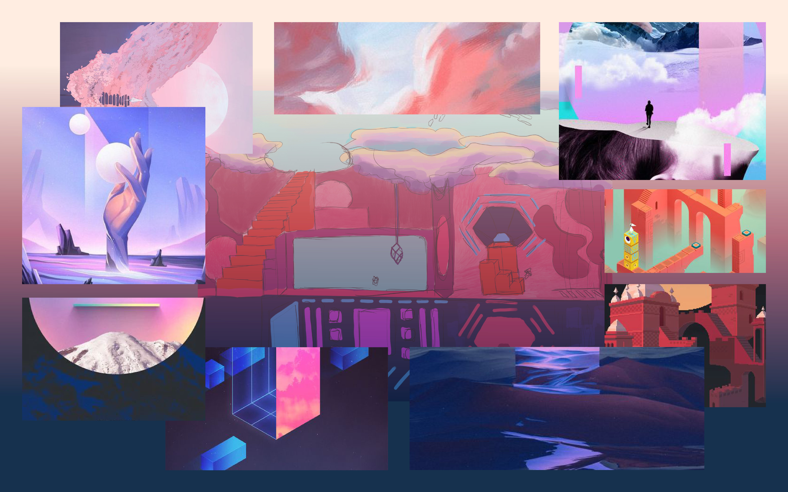

# Short Discription of Project 

At the beginning of the project the plan was to develop a storytelling website about philosophy and religion. These very daring plans have become concrete in the last weeks. The subject area was narrowed down to the - still philosophical - topic of freedom. Due to the current restrictions caused by the Corona virus, many discussions about "freedom" have been started. How much freedom do I have to give away? Is it a violation of personal freedom or the freedom of others if I follow or break certain rules? A **balance between individual freedom and the freedom of the collective** follows. Based on this topic, a game-like application will be developed, which resembles a kind of simulation on the one hand and a puzzle principle on the other. The game will be implemented with **p5 and the p5.play library**.

The player finds himself in a world in which he can move freely. Two values are displayed to the player: *Individual Freedom* and *Collective Freedom*. The values change depending on how the player moves in the world. After a while of trial and error, the player should figure out how the values are affected and can specifically try to achieve a certain score. There are six objects/areas in the world, which are meant to symbolize Corona-related limitations: *Mask, Single Contacts, Distance, Hygiene Regulation, Isolation, Zoom*. The six interactions were arranged differently in space. Here, the Y-axis reflects the differences in individual freedom (Top: flying, many contacts, sky -> much freedom. Bottom: Isolation, basement -> little freedom). The room has three different floors and is altogether larger than the viewport. Different value changes are planned for the interactions and through affordance/signifier and feedback the player should understand which objects are interactive.

 

The overall style is intended to appear dreamy and abstract, and the six interaction areas are intended to be represented metaphorically. (For example, the mask appears like a small cage around the player -> see image) The look and feel was made vivid in a moodboard:

The design of the game changes depending on how high the current values are. At a high collective value the background becomes more detailed and at a high individual value the player's image becomes more detailed. Thus the "value of freedom" is directly reflected in the visualization. 

Finally, the game can end up in four different scenarios: Both values are at 100%, One value is at 100% and the other is below 10% (and vice versa), Both values are below 10%. The game starts at 50% for both values. For each ending, a theoretical background on individual and collective freedom and the user's choices should be displayed.

