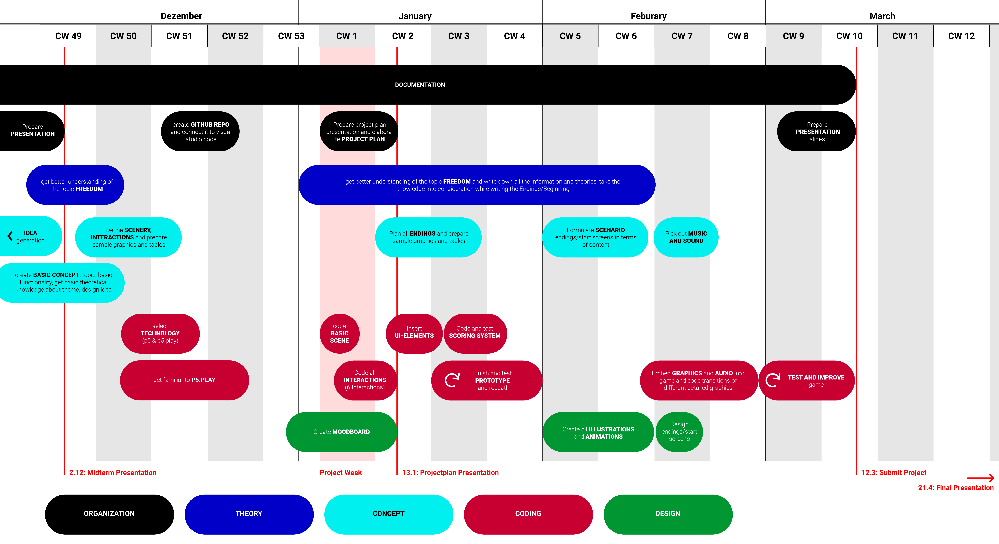

# Timetable 

#### NOVEMBER
- Idea generation 
- Create basic concept 
- - choose topic of project
- - basic functionality 
- - get basic theoretical knowledge about topic 
- - design ideas
- Prepare presentation
#### DECEMBER
- **Midterm presentation: 02.12.20**
- Define scenery and prepare sample graphics
- Define functions and create table
- Select technology 
- Get to grips with the technology (p5 play library)
- Create GitHub repo and do all preparations
#### JANUARY
**Project week**
- Code basic scene 
- - player movement
- - virtual camera
- - ground colliders
- Try out all functions 
- - Mask
- - Hygiene
- - Zoom
- - Distancing
- - Contact 
- - Isolation
- Use functions in scene 
- Prepare project plan presentation and elaborate project plan
- Do Moodboard
- **Projectplan Presentation: 13.1**
- Insert UI elements 
- Finish and test basic prototypes
- Plan all (4?) endings content
- Embed placeholder ending screens into the game
- Code and test scoring system so that all endings are easily possible and don't take too long to complete
#### FEBURARY
- Create all illustrations and animations 
- Embed illustrations and animations into game
- Code transitions of different detailed graphics
- Pick out and embed sound
- Formulate scenario endings/start screens in terms of content 
- Design endings/start screens and replace them in the game
#### MARCH
- Test and improve prototype
- Documentation
- Prepare presentation slides
- **Deadline to submit project, documentation and presentation: 12.03.21**
#### APRIL
- Prepare presentation
- **Final presentation: beginning of April 21**