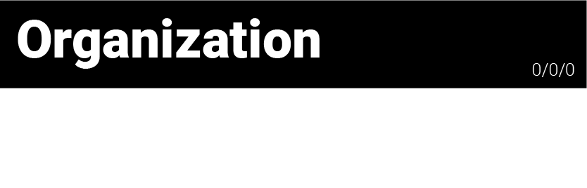
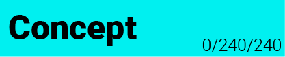

# TO-DO

- [Organization](#organization)
- [Concept](#conceptual-to-dos)
- [Theory](#theoretical-to-dos)
- [Programming](#programming-to-dos)
- [Design](#design-to-dos)
___

## Organization 
* [x] Timetable 
* [x] Short Discription
* [x] Setting up GitHub Repo
* [x] Write down all To-Do's
* [x] Save all references, links
* [ ] Documentation
* [x] Color Scheme for Doku: Orga: Black / Concept: Cyan / Theory: Blue / Programming: Red / Design: Green
  
___

## Conceptual To-Do's
* [x] Main Idea
* [x] Creating Map 
* [x] Creating different interactions
* [ ] Think about:
* * [x] Kind of functionality
* * [ ] Signifier, Affordance and Feedback
* * [ ] Kind of impact on Scoring System
* [ ] Creating different kinds of Endings (before adding Scoring System)
* [ ] Optional: Writing down examples of topics that match the game (f.e. climate change)

___

## Theoretical To-Do's
* [x] Analyze the subject of freedom
* [ ] Analyze individual/collective freedom
* [ ] Writing everything down
* [ ] Create Scenarios for the game based on theory 
* [ ] Write short discription of every scenario that the user can read in the end
* [ ] Write a short discription for the beginning

___

## Programming To-Do's
##### PLAYER
* [x] Player Movement (left, right and jumping)
* [x] Flying in upper area
* [x] Teleporting to lower area and back
* [x] Scoring: Player Movement 

##### MASK
* [x] Mask On/Off
* [x] Scoring: Mask On/Off

##### DISTANCING 
* [x] Distancing Function
* [x] Clone Distancing 
* [x] Scoring Distancing

##### HYGIENE
* [x] Creating Hygiene Area
* [x] Creating Rain (Animated or coded?)
* [x] Scoring Hygiene

##### SINGLE CONTACT
* [x] Single Contacts Function 
* [x] Scoring Single Contacts

##### ZOOM
* [x] Creating Zoom Area
* [x] Scoring Zoom 

##### ISOLATION
* [x] Creating Isolation Area
* [x] Scoring Isolation 

##### VIRTUAL CAMERA
* [x] Create a bigger Scene than the window size
* [x] Let the virtual Camera follow the player 
* [x] Make the camera stop moving at certain positions

##### SCORING
* [ ] Making the Scoring System work

##### ANIMATION
* [ ] Including all the illustrations and animations
* [ ] Making the Animations switch based on the values 

##### SOUND
* [ ] Including Sound
* [ ] Make Sound louder/quiter based on time spend in certain areas

##### UI ELEMENTS
* [x] Play/Pause
* [x] individual freedom value
* [x] collective freedom value
* [ ] Restart
* [ ] Sound On/Off
* [ ] Start Page
* [ ] Different Endings 
___

## Design To-Do's
* [x] Create Moodboard for look and feel 
* [ ] Make a Styleguide 
* [ ] Maybe choose one color for each interaction?

##### SOUND
* [ ] Choose Sound Effects (a effect for each interaction area: zoom, isolation, hygiene)
* [ ] Search for Sounds (a Sound for each short interaction: mask, distancing, contact, user input)
* [ ] Maybe a Sound for value impact?
* [ ] Serach for music (a song for each area: upper, middle, lower)

##### ILLUSTRATIONS AND ANIMATIONS
Creating the **background image** without any elements, the user will interact with/ moving elements
* [ ] low Score - picture
* [ ] ... (more pictures depending on time I have left)
* [ ] high Score - picture (detailed)
Creating the **interaction** illustrations and animations
* [ ] Player (low Score)
* [ ] Player (in between)
* [ ] Player (high Score)
* [ ] Player with Mask (low Score)
* [ ] Player with Mask (in between)
* [ ] Player with Mask (high Score)
* [ ] Mask alone (low Score)
* [ ] Mask alone (in between)
* [ ] Mask alone (high Score)
* [ ] Other people (low Score)
* [ ] Other people (in between)
* [ ] Other people (high Score)
* [ ] clouds
* [ ] rain
* [ ] isolation area lights
* [ ] zoom animation loop
* [ ] teleporting animation loop

