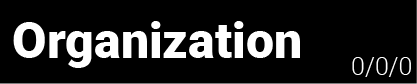
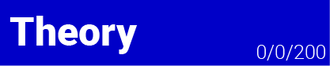
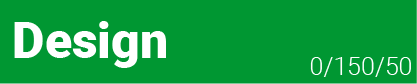

# TO-DO

- [Organization](#organization)
- [Concept](#conceptual-to-dos)
- [Theory](#theoretical-to-dos)
- [Programming](#programming-to-dos)
- [Design](#design-to-dos)
___

## Organization 
* [x] Timetable 
* [x] Short Discription
* [x] Setting up GitHub Repo
* [x] Write down all To-Do's
* [x] Save all references, links
* [x] Documentation
* [x] Color Scheme for Doku: Orga: Black / Concept: Cyan / Theory: Blue / Programming: Red / Design: Green
  
___

## Conceptual To-Do's
* [x] Main Idea
* [x] Creating Map 
* [x] Creating different interactions
* [x] Think about:
* * [x] Kind of functionality
* * [x] Signifier, Affordance and Feedback
* * [x] Kind of impact on Scoring System
* [x] Creating different kinds of Endings (before adding Scoring System)
* [x] Optional: Writing down examples of topics that match the game (f.e. climate change)

___

## Theoretical To-Do's
* [x] Analyze the subject of freedom
* [x] Analyze individual/collective freedom
* [x] Writing everything down
* [x] Create Scenarios for the game based on theory 
* [x] Write short discription of every scenario that the user can read in the end
* [x] Write a short discription for the beginning / tutorial

___

## Programming To-Do's
##### PLAYER
* [x] Player Movement (left, right and jumping)
* [x] Flying in upper area
* [x] Teleporting to lower area and back
* [x] Scoring: Player Movement 

##### MASK
* [x] Mask On/Off
* [x] Scoring: Mask On/Off

##### DISTANCING 
* [x] Distancing Function
* [x] Clone Distancing 
* [x] Scoring Distancing

##### HYGIENE
* [x] Creating Hygiene Area
* [x] Creating Rain (Animated or coded?)
* [x] Scoring Hygiene

##### SINGLE CONTACT
* [x] Single Contacts Function 
* [x] Scoring Single Contacts

##### ZOOM
* [x] Creating Zoom Area
* [x] Scoring Zoom 

##### ISOLATION
* [x] Creating Isolation Area
* [x] Scoring Isolation 

##### VIRTUAL CAMERA
* [x] Create a bigger Scene than the window size
* [x] Let the virtual Camera follow the player 
* [x] Make the camera stop moving at certain positions

##### SCORING
* [x] Making the Scoring System work

##### ANIMATION
* [x] Including all the illustrations and animations
* [x] Making the Animations switch based on the values 

##### SOUND
* [x] Including Sound

##### UI ELEMENTS
* [x] Play/Pause
* [x] individual freedom value
* [x] collective freedom value
* [x] Restart
* [x] Sound On/Off
* [x] Start Page
* [x] Different Endings 
___

## Design To-Do's
* [x] Create Moodboard for look and feel 
* [-] Make a Styleguide / only moodboard
* [-] Maybe choose one color for each interaction? / icons instead

##### SOUND
* [x] Choose Sound Effects (a effect for each interaction area: zoom, isolation, hygiene)
* [x] Search for Sounds (a Sound for each short interaction: mask, distancing, contact, user input)
* [x] Maybe a Sound for value impact?
* [x] Serach for music (a song for each area: upper, middle, lower)

##### ILLUSTRATIONS AND ANIMATIONS

[fertig gemalt] [eingepflegt]
- Player (Maße: 199 x 322 px)
  - [x] [x] Detailed mask
  - [x] [x] Detailed
  - [x] [x] halb Detailed mask
  - [x] [x] halb Detailed
  - [x] [x] bunt mask
  - [x] [x] bunt 
  - [x] [x] azsgeblichen mask
  - [x] [x] ausgeblichen 
  - [x] [x] S/W mask
  - [x] [x] S/W 
- Distancing (Maße: 44 x 34 px)
  - [x] [x] detailed Color1
  - [x] [x] detailed Color2
  - [x] [x] detailed Color3
  - [x] [x] bunt Color1
  - [x] [x] bunt Color2
  - [x] [x] bunt Color3
  - [x] [x] S/W Color1
  - [x] [x] S/W Color2
  - [x] [x] S/W Color3
- Single Contact (Maße: 133 x 178 px) TESTEN
  - [x] [x] detailed R Color1
  - [x] [x] detailed R Color2
  - [x] [x] detailed R Color3
  - [x] [x] detailed L Color1
  - [x] [x] detailed L Color2
  - [x] [x] detailed L Color3
  - [x] [x] bunt R Color1
  - [x] [x] bunt R Color2
  - [x] [x] bunt R Color3
  - [x] [x] bunt L Color1
  - [x] [x] bunt L Color2
  - [x] [x] bunt L Color3
  - [x] [x] S/W R Color1
  - [x] [x] S/W R Color2
  - [x] [x] S/W R Color3
  - [x] [x] S/W L Color1
  - [x] [x] S/W L Color2
  - [x] [x] S/W L Color3
- BG
  - [x] [x] detailed
  - [x] [x] halb
  - [x] [x] bunt
  - [x] [x] ausgeblichen
  - [x] [x] S/W

