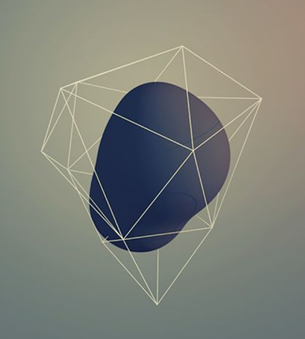
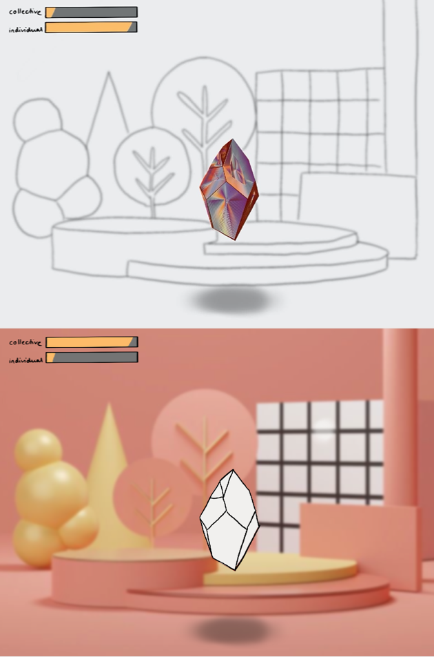

# DOCUMENTATION 
## A game about freedom


- [DOCUMENTATION](#documentation)
  - [A game about freedom](#a-game-about-freedom)
- [Short Discription](#short-discription)
- [November](#november)
  - [Link zu Presentation im November](#link-zu-presentation-im-november)
- [Dezember](#dezember)
  - [Link zu Projektplan und Aufgaben](#link-zu-projektplan-und-aufgaben)
- [Januar](#januar)
    - [Start Coding:](#start-coding)
      - [Viewport, Background and Camera](#viewport-background-and-camera)
      - [Collider](#collider)
      - [Gruppe in p5 play](#gruppe-in-p5-play)
      - [Player](#player)
      - [Distancing](#distancing)
    - [GUI](#gui)
- [Februar](#februar)
- [März](#märz)


# Short Discription

At the beginning of the project the plan was to develop a storytelling website about philosophy and religion. These very daring plans have become concrete in the last weeks. The subject area was narrowed down to the - still philosophical - topic of freedom. Due to the current restrictions caused by the Corona virus, many discussions about "freedom" have been started. How much freedom do I have to give away? Is it a violation of personal freedom or the freedom of others if I follow or break certain rules? A **balance between individual freedom and the freedom of the collective** follows. Based on this topic, a game-like application will be developed, which resembles a kind of simulation on the one hand and a puzzle principle on the other. The game will be implemented with **p5 and the p5.play library**.

The player finds himself in a world in which he can move freely. Two values are displayed to the player: *Individual Freedom* and *Collective Freedom*. The values change depending on how the player moves in the world. After a while of trial and error, the player should figure out how the values are affected and can specifically try to achieve a certain score. There are six objects/areas in the world, which are meant to symbolize Corona-related limitations: *Mask, Single Contacts, Distance, Hygiene Regulation, Isolation, Zoom*. The six interactions were arranged differently in space. Here, the Y-axis reflects the differences in individual freedom (Top: flying, many contacts, sky -> much freedom. Bottom: Isolation, basement -> little freedom). The room has three different floors and is altogether larger than the viewport. Different value changes are planned for the interactions and through affordance/signifier and feedback the player should understand which objects are interactive.


 

The overall style is intended to appear dreamy and abstract, and the six interaction areas are intended to be represented metaphorically. (For example, the mask appears like a small cage around the player -> see image) The look and feel was made vivid in a moodboard:




The design of the game changes depending on how high the current values are. At a high collective value the background becomes more detailed and at a high individual value the player's image becomes more detailed. Thus the "value of freedom" is directly reflected in the visualization. 



Finally, the game can end up in four different scenarios: Both values are at 100%, One value is at 100% and the other is below 10% (and vice versa), Both values are below 10%. The game starts at 50% for both values. For each ending, a theoretical background on individual and collective freedom and the user's choices should be displayed.


# November

## Link zu Presentation im November
Read more [here](./presentations/mid-term-presentation.pdf)


# Dezember

## Link zu Projektplan und Aufgaben
Read more [here](./timetable.md)
Read more [here](./To-Do.md)
Read more [here](./Best_Worst_Case.md)


Habe mich für p5 play entschieden und die Dokumentationen erstmal studiert. Während des gesamten Projekt habe ich ständig diese zwei Dokumentation verwendet.:


# Januar


### Start Coding: 

#### Viewport, Background and Camera
Im Januar habe ich mit der Arbeit am Code begonnen. Als erstes sollte die Spielwelt erschaffen werden. Dazu wurde die zuvor erstellte [Zeichnung](./media/) als Hintergrundbild verwendet. 

*Mein Stand [Anfang Januar](../sketch-jan-5.js)*

```javascript
function preload(){
    bgImg2 = loadImage("../img/BG-2.png");
} 
function setup() {
    createCanvas(windowWidth, windowHeight);
}
function draw() {
    background(bgImg2);
}
```

Da der Viewport `createCanvas(windowWidth, windowHeight);` jedoch kleiner sein sollte als die gesamte Szene `bg = createSprite(0, SCENE_H/2, SCENE_W, SCENE_H);`, habe ich für den Hintergrund ein *sprite* erstellt, welchem ich unterschiedliche Bilder hinzufügen konnte. Mit einer virtual camera konnte dann der Ausschnitt bestimmt werden, welcher sichtbar ist. Dieser Ausschnitt wurde dann an das Verhalten des Players geknüpft, sodass der Player immer in der Mitte des Viewports bleibt – außer der Player kommt zu nah an der Bildschirmrand, dann bleibt die Kamera stehen.
*Mein Stand [Anfang Januar](../sketch-jan-10.js)*

```javascript
let SCENE_W = 4000;
let SCENE_H = 3000;

function preload(){
    bgImg2 = loadImage("../img/BG-2.png");
} 
function setup() {
    createCanvas(windowWidth, windowHeight);

    bg = createSprite(0, SCENE_H/2, SCENE_W, SCENE_H);
    bg.addImage(bgBigImg1);
}
function draw() {
    camera.zoom = 1;
    ...
    let ScreenPlayerRelation = width/2;
    if (player1.position.x >= EDGE_R - ScreenPlayerRelation){
        camera.position.x = camera.position.x;
    }
    ...
    else{
    camera.position.x = player1.position.x;
    }
    ...
}
```


#### Collider

Für alle Plattformen und andere Objekte, mit denen der Spieler interagieren kann, habe ich weitere *sprites* erstellt. Es wurden für folgende Objekte sprites erstellt:
* Boden (Collider mit Player)
* Mittlere Plattform (Collider mit Player)
* Treppen (Collider mit Player)
* Flying Area (Durch Overlapping mit Player wird Score verändert)
* Gravity Area (Durch Overlapping mit Player setzt Gravity ein)
* Teleport Area 1 und 2 (Durch Overlapping mit Player wird player.position verändert)
* Maske (Durch Overlapping mit Player wird Score verändert)
* Hygiene Area (Durch Overlapping mit Player wird Score verändert)
* Zoom Area (Durch Overlapping mit Player wird Score verändert)
* Isolation Area (Durch Overlapping mit Player wird Score verändert)
* Einzelpersonen (Durch Overlapping mit Player wird Score verändert)
* Gruppenpersonen (Durch Overlapping mit Player wird Score verändert)
Die meisten *sprites* bleiben bei dem Spiel dabei unsichtbar.

```javascript
function setup() {
    ...
    ground = createSprite(0,SCENE_H,SCENE_W,50);
    middleGround = createSprite(0,(SCENE_H/3)*2,SCENE_W,20);
    ...
    flyingArea = createSprite(0,(SCENE_H/6),SCENE_W,SCENE_H/3);
    flyingArea.visible = false;
    gravityArea = createSprite(0,(SCENE_H)-(SCENE_H/3),SCENE_W,SCENE_H/1.5);
    gravityArea.visible = false;
    ...
}
function draw() {
    ...
    if (player1.overlap(flyingArea)){
    flying();
    }else{
    gravity = 1;
    }
    ...
    if(player1.collide(ground) || player1.collide(middleGround)) {
    player1.velocity.y = 0;
    }
    ...
}
```
#### Gruppe in p5 play

Für die einzelnen Kontakte und für die distancing-groups mussten p5-play-Gruppen erstellt werden. So konnten vielen Elementen die gleichen Atribute gegeben werden. Für die unterschiedlichen Interaktions-Elemente habe ich Funktionen erstellt, wie hier zum Beispiel `singlePeopleWalking()` .

```javascript
function setup() {
    ...
    singlepeople = new Group(); 
    for (let i = 0; i < 5; i++){
        s1 = createSprite(random(SCENE_W)-(SCENE_W/2),heightSinglePerson,200,100);
        s1.friction = random(0.001, 0.05);
        s1.shapeColor = color(200,0,50);
        s1.maxSpeed = 12;
    singlepeople.add(s1);
  }
    ...
}
function draw() {
    ...
    singlePeopleWalking ();
    ...
}
function singlePeopleWalking(){
    directionSingle = random(1,10)
      for (let i = 0; i < singlepeople.length; i++){
        singlepeople[i].attractionPoint(0.12, SCENE_W, heightSinglePerson); 
        if (singlepeople[i].overlap(rightEdgeCollider)){
          singlepeople[i].position.x = -(SCENE_W/2); 
        }
      }
}
```


#### Player

Für den Player wurde ebenfalls ein *sprite* erstellt, sodass der Player über einen Collider verfügt, welcher bei Berührung mit den anderen Colliders für die Events sorgt. Da der Player jedoch unterschiedlich aussehen sollte, je nachdem ob er eine Maske trägt, wurde dem *sprite* mehrere Bilder zugeordnet. Mit mehreren Boolean-Variabeln wurde dann geprüft, ob der Player die Maske trägt und ob er seit dem Anziehen der Maske den Boden nochmal berührt hat (weil sonst die Maske während der gesamten Zeit, in der der Player die Maske berührt, durchgehend an und ausgezogen wird.) Im gesamten Code für das Spiel habe ich dann sehr oft diese Boolean-Logik verwendet, um Events nur einmal (in einer bestimmten) im Draw-Loop auszulösen.

```javascript
function preload(){
    playerImg = loadImage("../img/woman.png");
    playerMaskImg = loadImage("../img/mask.png");
} 
function setup() {
    ...
    player1 = createSprite(0,0);
    player1.addImage(playerMaskImg);
    player1.addImage(playerImg);
    ...
}
function draw() {
    ...
    maskOnOff();
    ...
}
function maskOnOff(){
    //put on mask
    if(player1.overlap(maskPosition) && !maskOn && maskGroundCheck){
        player1.addImage(playerMaskImg);
        maskGroundCheck = false;
        maskOn = true; 
    }
    //Ground Check
    else if(player1.overlap(invisibleGroundCheck) && maskOn && !maskGroundCheck){
        maskGroundCheck = true;
    } 
    //put off mask
    if (player1.overlap(maskPosition) && maskOn && maskGroundCheck){
        player1.addImage(playerImg);
        maskGroundCheck = false;
        maskOn = false;
    }
    //Ground Check
    else if(player1.overlap(invisibleGroundCheck) && !maskOn && !maskGroundCheck){
        maskGroundCheck = true;
    }
}
```

Um den Player sich bewegen zu lassen, habe ich einerseits das Player-Movement in der Gravity-Area und einmal in der Flying-Area programmiert. Um die Position des Players zu ändern musste lediglich bei beispielsweise `keyIsDown(RIGHT_ARROW)` die `player1.position.x` verändert werden. Beim Fliegen wurde in alle vier Richtungen das erlaubt. Für das Springen musste die `player.velocity.y` verändert werden. Dabei wurde wieder ein GroundCheck mit einer Boolean-Variabel verwendet, sodass der Player nicht durchgehend springen kann.

```javascript
...
function draw() {
    ...
    if (player1.overlap(flyingArea)){
        flying();
    }else{
        gravity = 1;
    }
    ...
    //Jumping
    if(keyWentDown(' ') && playerGroundCheck && player1.overlap(gravityArea)){
        player1.velocity.y = -jump;
        playerGroundCheck = false;
    }
    ...
}
function flying(){
    ...
    gravity = 0; 
    if (keyIsDown(UP_ARROW)) {
        player1.position.y -= 10;
    }
    if (keyIsDown(DOWN_ARROW)) {
        player1.position.y += 10;
    }
    ...
}
```

BIS HIER IST DIE VERSION VOM 10. JANUAR

#### Distancing 

Vor allem mit der Programmierung für die Distancing-Funktion hatte ich große Schwierigkeiten. Dafür sollte eine Gruppe erstellt werden, die einem Attraktion-Point folgt. Der Attractionpoint sollte danach unsichtbar sein, sodass es aussieht als bewegten sich die Gruppe in Schwärmen. Mit einer Gruppe hat es relativ schnell funktioniert, jedoch gab es viele Probleme und Fehlversuche, um mehrere Gruppen zu erstellt, die unterschiedlichen Punkten folgt. 
Die erste Version sah so aus: 

https://molleindustria.github.io/p5.play/examples/index.html?fileName=sprite4.js

```javascript
function setup() {
    ...
    attraction1 = createSprite(random(width),height/2,20,20);
    distanceCharacter = new Group();
   
    for (let i = 0; i < 20; i++ ){
        c1 = createSprite(random(width), random(height), random(20,50), 20);
        c1.shapeColor = color(20,20,20);
        c1.maxSpeed = 12;
        c1.friction = random(0.05, 0.15);
        c1.rotateToDirection = true;
        distanceCharacter.add(c1);
    }
    ...
}
function draw() {
    ...
    distancingFunction();
    ...
}
function distancingFunction(){
    ...
    //Limiting area where attraction-points move
    if (attraction1.position.x  > EDGE_R){
        directionOfAttractionX = random(-4,-1);
    }
    ...

    attraction1.position.x += directionOfAttractionX;
    attraction1.position.y += directionOfAttractionY;

    //direction and speed of attraction character
    direction += random(1,5); 
    attraction1.setSpeed(random(2,3), direction); 

    for (let i = 0; i < distanceCharacter.length; i++ ){
        distanceCharacter[i].attractionPoint(0.12, attraction1.position.x, attraction1.position.y);
        distanceCharacter[i].setCollider("circle", 0, 0, 20);
        distanceCharacter.collide(distanceCharacter[i]); 
    } 
}
```

Um mehrere Gruppen zu erstellen musste ich viele Versuche starten. Bei manchen Versionen haben sich die Attractionpoints immer gelich bewegt oder die Gruppen sind nur einem Punkt gefolgt. Um das Problem zu lösen, dass die Attractionpoints sich nicht immer gleich bewegen (also in die gleiche Richtung bewegen), habe ich eine Klasse erstellt `class Attraction_points`. So hat jedes Objekt der Klasse seine eigenen Attribute.

```javascript
let distancing_groups = [];
let att_points = [];
let total_number_of_groups = 6;
let amount_of_characters = 40;

function setup() {
    ...
    for (let i = 0; i < total_number_of_groups; i++){
        distancing_groups[i] = new Group();
        att_points[i] = new Attraction_points(random(-SCENE_W/2, SCENE_W/2), random(SCENE_H/3), random(-2,2), random(-2,2));
        createSwarm(distancing_groups[i], att_points[i].positionX, att_points[i].positionY);
    }
    ...
}
function draw() {
    ...
    for (let i = 0; i < total_number_of_groups; i++){
    att_points[i].move();
    swarmFollowAttraction(distancing_groups[i], att_points[i].positionX, att_points[i].positionY);
  }
    ...
}

// CREATING SWARM
function createSwarm(distancing_group, attraction_pointX, attraction_pointY){
  for (let e = 0; e < amount_of_characters; e++ ){
    c1 = createSprite(...);
    ...
    c1.attractionPoint(29, attraction_pointX, attraction_pointY);
    distancing_group.add(c1);
  }
}

// SWARM FOLLOWS ATTRACTION POINT
function swarmFollowAttraction(distancing_group, attraction_pointX, attraction_pointY){
  
  for (let i = 0; i < amount_of_characters; i++){
    distancing_group[i].attractionPoint(random(0.08, 0.2), attraction_pointX, attraction_pointY);
    distancing_group[i].setCollider("circle", 0, 0, 20);
    distancing_group.collide(distancing_group[i]);
  }
  ...
}

// CREATING AND MOVING ATTRACTION POINTS
class Attraction_points {
  constructor(posX, posY, speedX, speedY){
      this.posX = posX;
      this.posY = posY;
      this.speedX = speedX;
      this.speedY = speedY;
  }

  get positionX (){
    return this.posX;
  }
  get positionY (){
    return this.posY;
  }

  move(){
    if(this.posX <= -(SCENE_W/2)){
        this.speedX = random(minSpeed,maxSpeed);
    }else if(this.posX >= SCENE_W/2){
        this.speedX = random(-maxSpeed,-minSpeed);
    }
    ...
    this.posX += this.speedX;
    ...
  }
}
```


BIS ENDE JANUAR

### GUI

Für die Userinterface-Elemente musste die camera mit `camera.off()` ausgeschaltet werden, sodass die Elemente auf dem Canvas absolut und nicht relativ in der Spielwelt angezeigt werden. Um die Farben der Scores zu ändern, je nachdem wie hoch der Score ist, habe ich mit der `map()`-Funktion Varibaeln gespeichert, welche gezielte Farbwerte für das Score-Interval von 0-100 speichern.

```javascript
function draw() {

    ...

    camera.off();

    ...

    let m = map(individualScore, 0, 100, 20, windowWidth/5);
    let c1 = map(individualScore, 0, 100, 250, 0);
    let c2 = map(individualScore, 0, 100, 0, 200);
    let c3 = map(individualScore,0, 100, 100, 150);

    ...

    noStroke();
    fill(c1,c2,c3);
    rect(20,20, m, (windowWidth/5)/4, r); //individual 

    ...

    camera.on();
}

```

Damit der User ein Feedback erhält, wenn der Score sich positiv oder negativ verändert, habe ich für das Wort "individual" und "collective" sowie für die Kontur der Score-Abbildung die Variabeln `fbS_I_r` (feedbackScore_Individual_red) etc. erstellt. Bei Events, in denen die Scores sich verändern wird dann einer der vier Funktionen `feedbackUpScoreI()`,`feedbackDownScoreI()`,`feedbackUpScoreC()`,`feedbackDownScoreC()` aufgerufen, die den entsprechenden Score entweder rot oder grün färben. Nach 500 Millisekunden der Aktion werden die Farbwerte wieder zurückgesetzt. Dafür wurde von der `setTimeout()`-Funktion Gebrauch gemacht, welche ich später mehrfach wieder benutzt habe.

```javascript
function draw() {
    ...
    camera.off();

    ...

    stroke(fbS_I_r, fbS_I_g, fbS_I_b);
    strokeWeight(3);
    noFill();
    rect(20,20, windowWidth/5, (windowWidth/5)/4, r); //individual

    ...

    fill(fbS_I_r, fbS_I_g, fbS_I_b);
    textAlign(CENTER);
    textSize(windowHeight/40);
    text("Individual", 20 + windowWidth/10, 20 + windowWidth/35);

    ...

    camera.on();
}

function feedbackUpScoreI(){
    fbS_I_g = 200;
    fbS_I_b = 150;
    setTimeout(function(){fbS_I_g = 0; fbS_I_b = 0;}, 500);
}

```
- Zweiter Hintergrund
- Scoring System
- Rain

# Februar


# März


