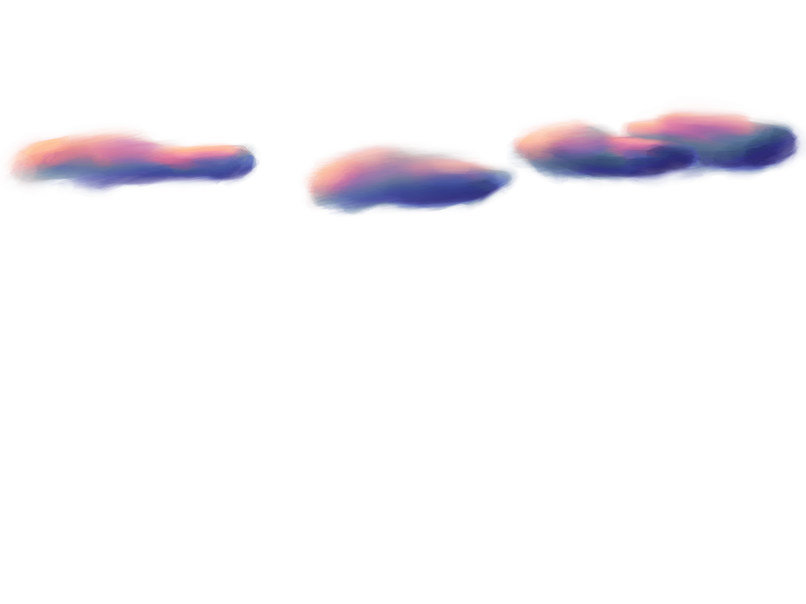

DOCUMENTATION


- [Short Discription](#short-discription)
- [November](#november)
  - [First idea and concept](#first-idea-and-concept)
  - [Ideenentwicklung](#ideenentwicklung)
  - [Best Practice Beispiele](#best-practice-beispiele)
  - [Update Concept 30. November](#update-concept-30-november)
- [Dezember](#dezember)
  - [Mid-term presentation](#mid-term-presentation)
  - [Konrektisierung und Visualisierung](#konrektisierung-und-visualisierung)
- [Januar](#januar)
    - [Start Coding](#start-coding)
    - [Viewport, Background and Camera](#viewport-background-and-camera)
    - [Collider](#collider)
    - [Gruppe in p5 play](#gruppe-in-p5-play)
    - [Player](#player)
      - [Maske](#maske)
      - [Player Movement](#player-movement)
    - [Distancing](#distancing)
    - [GUI](#gui)
      - [Display Scores/Buttons](#display-scoresbuttons)
      - [Feedback through color](#feedback-through-color)
      - [Pause](#pause)
    - [Second Background](#second-background)
    - [More interactive elements](#more-interactive-elements)
    - [Scoring System](#scoring-system)
      - [Hygiene](#hygiene)
      - [Isolation and Zoom](#isolation-and-zoom)
- [Februar](#februar)
  - [Animations and Illustrations 2 - 20 Feburary](#animations-and-illustrations-2---20-feburary)
  - [Einbettung in das Spiel 20 Feb - 25 Feb](#einbettung-in-das-spiel-20-feb---25-feb)
  - [Starting Screen](#starting-screen)
  - [Überarbeitung der Buttons/Icons](#überarbeitung-der-buttonsicons)
- [März](#märz)


# Short Discription

At the beginning of the project the plan was to develop a storytelling website about philosophy and religion. These very daring plans have become concrete in the last weeks. The subject area was narrowed down to the - still philosophical - topic of freedom. Due to the current restrictions caused by the Corona virus, many discussions about "freedom" have been started. How much freedom do I have to give away? Is it a violation of personal freedom or the freedom of others if I follow or break certain rules? A **balance between individual freedom and the freedom of the collective** follows. Based on this topic, a game-like application will be developed, which resembles a kind of simulation on the one hand and a puzzle principle on the other. The game will be implemented with **p5 and the p5.play library**.

The player finds himself in a world in which he can move freely. Two values are displayed to the player: *Individual Freedom* and *Collective Freedom*. The values change depending on how the player moves in the world. After a while of trial and error, the player should figure out how the values are affected and can specifically try to achieve a certain score. There are six objects/areas in the world, which are meant to symbolize Corona-related limitations: *Mask, Single Contacts, Distance, Hygiene Regulation, Isolation, Zoom*. The six interactions were arranged differently in space. Here, the Y-axis reflects the differences in individual freedom (Top: flying, many contacts, sky -> much freedom. Bottom: Isolation, basement -> little freedom). The room has three different floors and is altogether larger than the viewport. Different value changes are planned for the interactions and through affordance/signifier and feedback the player should understand which objects are interactive.


The overall style is intended to appear dreamy and abstract, and the six interaction areas are intended to be represented metaphorically. (For example, the mask appears like a small cage around the player -> see image) The look and feel was made vivid in a moodboard:


The design of the game changes depending on how high the current values are. At a high collective value the background becomes more detailed and at a high individual value the player's image becomes more detailed. Thus the "value of freedom" is directly reflected in the visualization. 


Finally, the game can end up in four different scenarios: Both values are at 100%, One value is at 100% and the other is below 10% (and vice versa), Both values are below 10%. The game starts at 50% for both values. For each ending, a theoretical background on individual and collective freedom and the user's choices should be displayed.


____


# November

## First idea and concept 

* Website that combines scrollitelling content and the genre of "interactive film“.
* topic: philosophical/religious topics, such as God, morality, soul/the "I" etc. (Maybe just one topic for the project, because otherwise it would be too elaborate. Epistemology possibly with visualization of the Höhlengleichnis or morality with the Trolly problem)
* Visualization of philosophical theories 
* Target group: Children 
* Goal: To show children the issues of that there are different realities and truths. Categorizations into right and wrong are subjective.

* Since in schools and at home often only one point of view is taught
During the scrollitelling and at the end of each path, information should be displayed that shows how different philosophical currents or religions stand on the topics
* Vector-based style for animation. Similar to "in a nutshell


## Ideenentwicklung

* *Example topic* | **Digitalization**: Designing time - acceleration through digitalization // Why are so many people passively engaged with digital media, even though we lose time because of it (and everyone complains about having little time). // Experiment: Taking away a sense - Interview only (audio) vs Interview (video and audio): Which seems longer? // Solution: A mindfulness smartphone // By taking out stimuli, can you reduce addiction? Without removing functions?
* *Example topic* | **Death**: the representation of death (visualization of something not visible) in animations // "Being dead" is in language a being. So an existing state. So in general death is seen as a kind of being?
* *Example topic* | **Empathy**: Animation film: an artificial-human machine, more human than a non-sentient human due to acceleration?
Example theme aesthetics: aesthetics as meaning of life. Reflecting as meaning. The beauty and the aesthetic sensation. Why? Because it is something unimportant for us/not important for survival and yet we see the value/desirable. Is it that what distinguishes humans from animals? That which goes beyond us and we do not understand but still somehow recognize.
Or a game, which shows you all your effects (maybe you are in everyday life and everything you do gets more points and these points turn out in the end as an ecological footprint) points system of *the good place*, maybe also as a preoccupation with the question of freedom. Your freedom must include the freedom of others -> very exciting under current considerations of corona. People go to demonstrate against Corona, because they feel their freedom is affected, but it is about the freedom of all. -> In the Corona game it could start in a color world and the more colors are added, the more one pays attention to the freedom of the others in the decisions, so that in the end a life comes about that is much more colorful and "free" by understanding freedom as a collective concept. The big theme is "freedom" and it is demonstrated by the example of Corona // All in all because of the question why persons decide to be Corona opponents and act so self-centered. As if freedom is only related to one's own person.
The game has two endings: once joined a conspiracy theory and once stayed at home (score how many people you infected (too macabre?))
Using 2d and 3d?
Maybe it is just one scene like a puzzle and more details get added the closer you get to the solution (like an interactive movie and the hint if you do something right or wrong is the amount of detail in the scene) -> like realizing what is true and what not (cave equation ) -> The background stays the same as we scroll and new UI elements 
pop up and the background is transitioning -> If I make a mix with a real story the protagonist doesn't have to be like a human being, it can be a shape as well 

## Best Practice Beispiele

* Beautiful website example style: lusion.co
* cineShader: https://cineshader.com
* https://molleindustria.org/demsocsim/
* Simulatot/Chain reactions
* https://ncase.me/polygons/
* https://github.com/periode/politics-of-code/blob/master/assets/readings/04-modeling/RhetoricVideoGames.pdf
* https://www.molleindustria.org/
* Every day the same dream: good example 
* A game in which you can only use the arrow-keys and spacebar for interaction (vertical scrollitelling) of a story which is a loop but u need to to something differently to get further


## Update Concept 30. November

* Topic: Interactive visualization of the dependency of freedom between individual and collective -> Freedom as a thought that does not depend only on one subject, because freedom is a game between own freedom and letting others have freedom
* Best Practice: Every day the same dream // democratic socialist // Grow
* Principle: User can make decisions that influence two values (freedom collective and freedom individual) -> The goal is to get both values balanced over a certain minimum, the decisions influence the values and the values influence the other value 
* Topic can be transferred to today's topic with Corona and a decision would be for example to wear masks
* Scenery is like in the Best Practice example an everyday scene, which contains about
5 screen widths and the decisions to be made have to be found 
Web-based it should be and you go through vertical scrolling and you can click the interactive states 
* Design: Preferably rather abstract (like Pierre's example with the triangles and squares), but the two values should be visually recognizable by the richness of detail of the subject and the background


* Advanced: if decisions were made, they might also change the gaming behavior perhaps. For example, when a mask is put on, the subject becomes faster or something like that
* things that you can interact with -> different „states“ that influence the two values -> mask (metaphor like maybe a cage, slowing someone down
  * -> seeing people (where you stand, being next to someone else)
  * -> washing/disinfecting hands (something that you have to do like every 1 minute)


____


# Dezember

## Mid-term presentation

In November I developed the concept further and narrowed it down a lot. While at the beginning of the semester the plan was to create a scrollitelling website about philosophy and religion, the plan became more concrete in November. I also prepared [presentation](./presentations/mid-term-presentation.pdf) for the mid-term presentation.


## Konrektisierung und Visualisierung 

Im Dezember habe ich begonnen die Szene für das Spiel zu skizieren und zu planen. Ich habe mir verschiedene Interaktionen ausgedacht und diese in die Szene integriert. 
Ich habe folgende List erstellt, die die Interaktionen – und ihre Auswikung – visualisiert:


 


Außerdem habe ich den [Projektplan] erstellt. Passend zum Projektplan, habe ich für einen besseren Überblick, alle [To-Dos] aufgelistet. Für die Zielsetzung haben wir die [Best und Worst Case Scenarios] definiert.


Ich habe mich dazu entschieden das Spiel mit der p5-play-library zu erstellen, da es sich um ein Spiel handeln sollte, welches im Browser gespielt werden kann. Den Rest des Dezembers habe ich dafür genutzt mich mit den [p5-play-library] auseinanderzusetzen. Während des gesamten Projekt habe ich ständig diese zwei Dokumentation verwendet.:


https://creative-coding.decontextualize.com/making-games-with-p5-play/


____


# Januar

### Start Coding

In January during the project week I had the conception of the project mostly ready, so I sat down to the code for the first time. Since it is my first big coding project, I tried to make a plan for the project week. The sequence of the project was as follows:
- Create scene
- Insert background 
- Add camera 
- Add all interactive elements 
- Player Movement
  
*Mein Stand [Anfang Januar](../sketch-jan-5.js)*


### Viewport, Background and Camera
In January I started working on the code. The first thing to do was to create the game world. For this the previously created [drawing](./media/) was used as background image.


```javascript
function preload(){
    bgImg2 = loadImage("../img/BG-2.png");
} 
function setup() {
    createCanvas(windowWidth, windowHeight);
}
function draw() {
    background(bgImg2);
}
```

Since the viewport `createCanvas(windowWidth, windowHeight);` should be smaller than the whole scene `bg = createSprite(0, SCENE_H/2, SCENE_W, SCENE_H);`, I created a *sprite* for the background, to which I could add different images. With a virtual camera it was then possible to determine the section which is visible. This section was then linked to the behavior of the player, so that the player always stays in the middle of the viewport - unless the player gets too close to the edge of the screen, then the camera stops.


```javascript
let SCENE_W = 4000;
let SCENE_H = 3000;

function preload(){
    bgImg2 = loadImage("../img/BG-2.png");
} 
function setup() {
    createCanvas(windowWidth, windowHeight);

    bg = createSprite(0, SCENE_H/2, SCENE_W, SCENE_H);
    bg.addImage(bgBigImg1);
}
function draw() {
    camera.zoom = 1;
    ...
    let ScreenPlayerRelation = width/2;
    if (player1.position.x >= EDGE_R - ScreenPlayerRelation){
        camera.position.x = camera.position.x;
    }
    ...
    else{
    camera.position.x = player1.position.x;
    }
    ...
}
```


### Collider

For all platforms and other objects the player can interact with, I created more *sprites*. Sprites were created for the following objects:
* Ground (collider with player)
* Middle platform (collider with player)
* Stairs (Collider with Player)
* Flying Area (Overlapping with player changes score)
* Gravity Area (Overlapping with Player sets Gravity)
* Teleport Area 1 and 2 (Overlapping with Player changes player.position)
* Mask (Overlapping with player changes score)
* Hygiene Area (Overlapping with player changes score)
* Zoom Area (Overlapping with player changes score)
* Isolation Area (Overlapping with player changes score)
* Individuals (score is changed by overlapping with player)
* Group persons (score is changed by overlapping with player)
Most *sprites* remain invisible in the game.


```javascript
function setup() {
    ...
    ground = createSprite(0,SCENE_H,SCENE_W,50);
    middleGround = createSprite(0,(SCENE_H/3)*2,SCENE_W,20);
    ...
    flyingArea = createSprite(0,(SCENE_H/6),SCENE_W,SCENE_H/3);
    flyingArea.visible = false;
    gravityArea = createSprite(0,(SCENE_H)-(SCENE_H/3),SCENE_W,SCENE_H/1.5);
    gravityArea.visible = false;
    ...
}
function draw() {
    ...
    if (player1.overlap(flyingArea)){
    flying();
    }else{
    gravity = 1;
    }
    ...
    if(player1.collide(ground) || player1.collide(middleGround)) {
    player1.velocity.y = 0;
    }
    ...
}
```
### Gruppe in p5 play

For the individual contacts and for the distancing groups, p5-play groups had to be created. This way many elements could be given the same attributes. For the different interaction elements I created functions, like here `singlePeopleWalking()` .

```javascript
function setup() {
    ...
    singlepeople = new Group(); 
    for (let i = 0; i < 5; i++){
        s1 = createSprite(random(SCENE_W)-(SCENE_W/2),heightSinglePerson,200,100);
        s1.friction = random(0.001, 0.05);
        s1.shapeColor = color(200,0,50);
        s1.maxSpeed = 12;
    singlepeople.add(s1);
  }
    ...
}
function draw() {
    ...
    singlePeopleWalking ();
    ...
}
function singlePeopleWalking(){
    directionSingle = random(1,10)
      for (let i = 0; i < singlepeople.length; i++){
        singlepeople[i].attractionPoint(0.12, SCENE_W, heightSinglePerson); 
        if (singlepeople[i].overlap(rightEdgeCollider)){
          singlepeople[i].position.x = -(SCENE_W/2); 
        }
      }
}
```


### Player

#### Maske

A *sprite* was also created for the player, so that the player has a collider that provides the events when it touches the other colliders. However, since the player should look different depending on whether it wears a mask, several images were assigned to the *sprite*. Several boolean variables were then used to check whether the player was wearing the mask and whether he had touched the ground again since putting on the mask (because otherwise the mask would be on and off continuously for the entire time the player was touching the mask). Throughout the code for the game, I then very often used this Boolean logic to trigger events only once (in a given) in the draw loop.


```javascript
function preload(){
    playerImg = loadImage("../img/woman.png");
    playerMaskImg = loadImage("../img/mask.png");
} 
function setup() {
    ...
    player1 = createSprite(0,0);
    player1.addImage(playerMaskImg);
    player1.addImage(playerImg);
    ...
}
function draw() {
    ...
    maskOnOff();
    ...
}
function maskOnOff(){
    //put on mask
    if(player1.overlap(maskPosition) && !maskOn && maskGroundCheck){
        player1.addImage(playerMaskImg);
        maskGroundCheck = false;
        maskOn = true; 
    }
    //Ground Check
    else if(player1.overlap(invisibleGroundCheck) && maskOn && !maskGroundCheck){
        maskGroundCheck = true;
    } 
    //put off mask
    if (player1.overlap(maskPosition) && maskOn && maskGroundCheck){
        player1.addImage(playerImg);
        maskGroundCheck = false;
        maskOn = false;
    }
    //Ground Check
    else if(player1.overlap(invisibleGroundCheck) && !maskOn && !maskGroundCheck){
        maskGroundCheck = true;
    }
}
```

#### Player Movement


To make the player move, I programmed the player movement in the Gravity-Area on the one hand and in the Flying-Area on the other hand. To change the position of the player only the `player1.position.x` had to be changed at for example `keyIsDown(RIGHT_ARROW)`. For flying, this was allowed in all four directions. For jumping the `player.velocity.y` had to be changed. Again a GroundCheck with a Boolean variable was used, so that the player cannot jump continuously.

```javascript
...
function draw() {
    ...
    if (player1.overlap(flyingArea)){
        flying();
    }else{
        gravity = 1;
    }
    ...
    //Jumping
    if(keyWentDown(' ') && playerGroundCheck && player1.overlap(gravityArea)){
        player1.velocity.y = -jump;
        playerGroundCheck = false;
    }
    ...
}
function flying(){
    ...
    gravity = 0; 
    if (keyIsDown(UP_ARROW)) {
        player1.position.y -= 10;
    }
    if (keyIsDown(DOWN_ARROW)) {
        player1.position.y += 10;
    }
    ...
}
```

*Mein Stand [Nach Projektwoche](../sketch-jan-10.js)*


### Distancing 

Especially with the programming for the distancing function I had great difficulties. For this, a group should be created that follows an attraction point. The attraction point should be invisible afterwards, so that it looks like the group is moving in swarms. With one group it worked relatively fast, but there were many problems and failed attempts to create multiple groups following different points. 
The first version looked like this: 

https://molleindustria.github.io/p5.play/examples/index.html?fileName=sprite4.js

```javascript
function setup() {
    ...
    attraction1 = createSprite(random(width),height/2,20,20);
    distanceCharacter = new Group();
   
    for (let i = 0; i < 20; i++ ){
        c1 = createSprite(random(width), random(height), random(20,50), 20);
        c1.shapeColor = color(20,20,20);
        c1.maxSpeed = 12;
        c1.friction = random(0.05, 0.15);
        c1.rotateToDirection = true;
        distanceCharacter.add(c1);
    }
    ...
}
function draw() {
    ...
    distancingFunction();
    ...
}
function distancingFunction(){
    ...
    //Limiting area where attraction-points move
    if (attraction1.position.x  > EDGE_R){
        directionOfAttractionX = random(-4,-1);
    }
    ...

    attraction1.position.x += directionOfAttractionX;
    attraction1.position.y += directionOfAttractionY;

    //direction and speed of attraction character
    direction += random(1,5); 
    attraction1.setSpeed(random(2,3), direction); 

    for (let i = 0; i < distanceCharacter.length; i++ ){
        distanceCharacter[i].attractionPoint(0.12, attraction1.position.x, attraction1.position.y);
        distanceCharacter[i].setCollider("circle", 0, 0, 20);
        distanceCharacter.collide(distanceCharacter[i]); 
    } 
}
```

To create multiple groups I had to make many attempts. In some versions the attraction points always moved in the same way or the groups followed only one point. To solve the problem that the attraction points do not always move the same way (i.e. in the same direction), I created a class `class Attraction_points`. So each object of the class has its own attributes.

```javascript
let distancing_groups = [];
let att_points = [];
let total_number_of_groups = 6;
let amount_of_characters = 40;

function setup() {
    ...
    for (let i = 0; i < total_number_of_groups; i++){
        distancing_groups[i] = new Group();
        att_points[i] = new Attraction_points(random(-SCENE_W/2, SCENE_W/2), random(SCENE_H/3), random(-2,2), random(-2,2));
        createSwarm(distancing_groups[i], att_points[i].positionX, att_points[i].positionY);
    }
    ...
}
function draw() {
    ...
    for (let i = 0; i < total_number_of_groups; i++){
    att_points[i].move();
    swarmFollowAttraction(distancing_groups[i], att_points[i].positionX, att_points[i].positionY);
  }
    ...
}

// CREATING SWARM
function createSwarm(distancing_group, attraction_pointX, attraction_pointY){
  for (let e = 0; e < amount_of_characters; e++ ){
    c1 = createSprite(...);
    ...
    c1.attractionPoint(29, attraction_pointX, attraction_pointY);
    distancing_group.add(c1);
  }
}

// SWARM FOLLOWS ATTRACTION POINT
function swarmFollowAttraction(distancing_group, attraction_pointX, attraction_pointY){
  
  for (let i = 0; i < amount_of_characters; i++){
    distancing_group[i].attractionPoint(random(0.08, 0.2), attraction_pointX, attraction_pointY);
    distancing_group[i].setCollider("circle", 0, 0, 20);
    distancing_group.collide(distancing_group[i]);
  }
  ...
}

// CREATING AND MOVING ATTRACTION POINTS
class Attraction_points {
  constructor(posX, posY, speedX, speedY){
      this.posX = posX;
      this.posY = posY;
      this.speedX = speedX;
      this.speedY = speedY;
  }

  get positionX (){
    return this.posX;
  }
  get positionY (){
    return this.posY;
  }

  move(){
    if(this.posX <= -(SCENE_W/2)){
        this.speedX = random(minSpeed,maxSpeed);
    }else if(this.posX >= SCENE_W/2){
        this.speedX = random(-maxSpeed,-minSpeed);
    }
    ...
    this.posX += this.speedX;
    ...
  }
}
```


BIS ENDE JANUAR

### GUI

#### Display Scores/Buttons

For the userinterface elements the camera had to be turned off with `camera.off()`, so that the elements on the canvas are shown absolutely and not relatively in the game world. The buttons and elements I added with simple p5 functions like `rect` or `ellipse`. To change the colors of the scores depending on how high the score is, I used the `map()` function to store varibbles that store targeted color values for the score interval from 0-100.

```javascript
function draw() {

    ...

    camera.off();

    ...

    let m = map(individualScore, 0, 100, 20, windowWidth/5);
    let c1 = map(individualScore, 0, 100, 250, 0);
    let c2 = map(individualScore, 0, 100, 0, 200);
    let c3 = map(individualScore,0, 100, 100, 150);

    ...

    noStroke();
    fill(c1,c2,c3);
    rect(20,20, m, (windowWidth/5)/4, r); //individual 

    ...

    camera.on();
}

```

#### Feedback through color

To give the user feedback when the score changes positively or negatively, I created the variables `fbS_I_r` (feedbackScore_Individual_red) etc. for the word `individual` and `collective` as well as for the contour of the score image. For events in which the scores change, one of the four functions `feedbackUpScoreI()`,`feedbackDownScoreI()`,`feedbackUpScoreC()`,`feedbackDownScoreC()` is then called, coloring the corresponding score either red or green. After 500 milliseconds of action, the color values are reset. For this, use was made of the `setTimeout()` function, which I used again several times later.

```javascript
function draw() {
    ...
    camera.off();

    ...

    stroke(fbS_I_r, fbS_I_g, fbS_I_b);
    strokeWeight(3);
    noFill();
    rect(20,20, windowWidth/5, (windowWidth/5)/4, r); //individual

    ...

    fill(fbS_I_r, fbS_I_g, fbS_I_b);
    textAlign(CENTER);
    textSize(windowHeight/40);
    text("Individual", 20 + windowWidth/10, 20 + windowWidth/35);

    ...

    camera.on();
}

function feedbackUpScoreI(){
    fbS_I_g = 200;
    fbS_I_b = 150;
    setTimeout(function(){fbS_I_g = 0; fbS_I_b = 0;}, 500);
}

```

#### Pause
For the pause button function, I packed the entire contents of the draw function into an if-condition. When the button is pressed, I then set this condition to false so that the game cannot continue to run. Since the `mousePressed()` function I use to flip the boolean is outside the `draw()` function, the condition can be set back to true and the game continues.

```javascript
let running = true;

function mousePressed(){
    if(mouseX > 20 && mouseX < 20 + windowWidth/10 && mouseY > windowHeight - (windowHeight/10) && mouseY < windowHeight - (windowHeight/20)) {
    running = !running; // flip the boolean
    ...
}
function draw() {
    if(running){
        ...
    }
}
```

### Second Background 

To create an illusion of depth, I decided to have the foreground and background move differently. So it appears that the foreground is closer to the player. The background (`bg_back`) now moves relative to the position of the player. However, to prevent the edge of the back image from protruding into the viewport when the player is at the edge of the playfield, the background image must be larger than the foreground. While the illustrations for the foreground should be 4000x3000px, the background must be 4300x3000px.

```javascript
function setup(){
    bg_back = createSprite(0, SCENE_H/2, SCENE_W, SCENE_H);
    bg = createSprite(0, SCENE_H/2, SCENE_W, SCENE_H);
    }
function draw() {
    for(let i = -1910 ; i < player1.position.x; i++){
        bg_back.position.x = -(i/10);
    }
}
```

### More interactive elements

### Scoring System

Now that all the interactive elements have been added, the influences of these on the scoring system had to be inserted. 

#### Hygiene

I coded many influences on the score by the `overlap()` method available in the p5-play-library. If the player is within a certain area, the score is affected accordingly. For a one-time boost, like in the hygiene area, I added a boolean varibael so that it only applies once. When leaving the area, the varibael is reset with `setTimeout()` after 20000 milliseconds, so that a new boost can take place.

```javascript
function draw() {
    hygieneScore();
}

function hygieneScore(){
    if (player1.overlap(hygieneArea) && boostHygine === false){
      boostHygine = true;
      feedbackUpScoreC();
      feedbackDownScoreI();
      collectiveScore += 20;
      individualScore -= 10;
    }else if (player1.overlap(hygieneArea) === false && boostHygine && !hasStartedTimeoutH){
      hygieneBoostIntervall = setTimeout(function(){boostHygine = false; hasStartedTimeoutH = false;}, 20000); 
      hasStartedTimeoutH = true;
    }
}
```

#### Isolation and Zoom

Some values should not change statically, but for example should increase/decrease more and more. For example, when staying in the isolation area, the individual value should decrease more if the player has been there for a longer time. For this I introduced a variable `lonely`, which indicates how lonely the player already is. 1 would be in this case not lonely and 10 very lonely. The value is multiplied by 0.001 throughout, so that it increases faster and faster. 

```javascript
function draw() {
    isolationScore();
}
let lonely = 1; //1= not lonely ; 10 = very lonely
function isolationScore(){
    let insideIsolationArea;
    if (lonely <= 1){lonely = 1;}else if(lonely >= 10){lonely = 10;}
    if (player1.overlap(isolationArea)){
        insideIsolationArea = true;
    }else{
        insideIsolationArea = false;
    }
    if (insideIsolationArea){
        feedbackDownScoreI();
        lonely *= 1.001;
        individualScore -= lonely * 0.001;
        collectiveScore += lonely * 0.001;
    }else{
        lonely *= 0.999; 
    }
}
```

The same principle is used to influence the score within the zoom range. In this case the variable `boring` was introduced.


- Rain


*Mein Stand [nach Januar](../sketch-feb-2.js)*


# Februar

## Animations and Illustrations 2 - 20 Feburary

Das Illustrieren aller Illustrationen und Animationen hat über 2 Wochen im Februar in Anspruch genommen. Eine Übersicht über alle nötigen Illustration findet man [hier] unter Animationen. 

Die Illustrationen habe ich mit [procrate](https://procreate.art) auf meinem Tablet erstellt und als png-Dateien exportiert. 

Für den Hintergrund der Spielwelt habe ich eine Illustration (4000x3000px) erstellt. Da der sich der Hintergrund unterschiedlich zum Vordergrund bewegen sollte, musste ich zwei getrennte Illustrationen anfertigen. Zusätzlich habe ich 5 unterschiedlich detaillierte Illustrationen für die Wolken angefertigt, da die Wolken sich unabhängig vom Hintergrund bewegen. Darüberhinaus habe ich die Spielwelt in fünf unterschiedlichen Detail-Grads erstellt. 





Für die Player-Figur habe ich mich für eine Bubble-Animation entschieden. Da das gesamte Spiel eher symbolisch und abstrakt wirken soll, erschien mir eine nicht-menschliche Figur passend. Die Bubble verliert in einem Animationscycle ein kleines Bläschen. Dieser Prozess soll das Atmen des Menschen symbolisieren. Wenn der Player eine Maske trägt, ist das kleine Blässchen kleiner. Ich habe eine Animation für den Player mit und ohne Maske mit jeweils ein mal mit und ein mal ohne Schatten. Die Animation ohne Schatten sollte abgespielt werden wenn der Spieler springt oder fliegt. Diese vier unterschiedlichen Animationen habe ich für alle 5 Detail-Grade erstellt, sodass ich 20 verschiedene Player-Animationen erstellt habe. Da jede Animation aus 11 Einzelbildern besteht, habe ich für den Player insgesamt 220 Einzelbilder erstellt.


Für die Einzelkontakte habe ich jeweils fünf Animationen für die, die nach rechts gehen und fünf für die, die nach links gehen angefertigt. Die Animationen konnten nicht einfach gespiegelt werden, da die Highlights sonst spiegelverkehrt gewesen wären. Die Animationscycles für die Einzelkontakte bestehen aus 10 Einzelbildern.


Für die Gruppenkontakte (Schwärme im Himmel) habe ich ebenfalls Animationen angefertigt. Die Gruppen sollten aus drei verschiedenen Farben bestehen und jede Animation umfastte 7 Einzelbilder. Bei der Implementierung der Animationen in den Sketch hat es das Spiel – vermutlich aufgrund der hohen Zahl der *sprites* – sehr verlangsamt, sodass ich mich dazu entschieden habe nur Einzelbilder statt Aniamtionen zu verwenden. 


Für das Favicon habe ich eine abgewandelte und optimierte Version einer der Player-Illustrationen verwendet.


Da die Zoom-/Digital-Media-Bereiche einem leuchtenden Screen ähneln sollte habe ich mich dazu entschieden außerdem mit procreate weichgezeichnete "Lichter" zu illustrieren. 

Insgesamt habe ich ... Einzelbilder gezeichnet und eingepflegt.
5 Hintergrund
5 Vordergrund 
5 Wolken
220 Playerfigur
100 Einzelkontakte 
105 Distancing
4 Lichter 
1 Favicon 


## Einbettung in das Spiel 20 Feb - 25 Feb

## Starting Screen 

## Überarbeitung der Buttons/Icons 


# März


