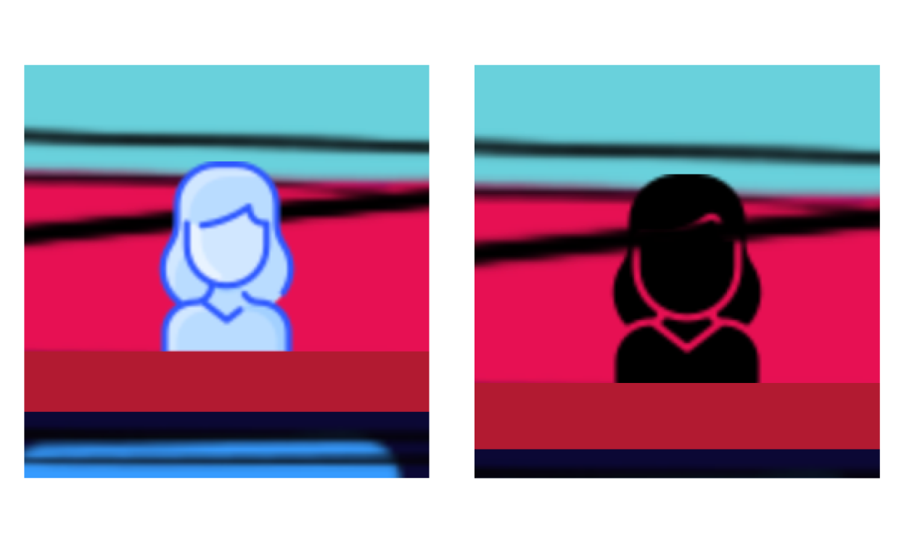
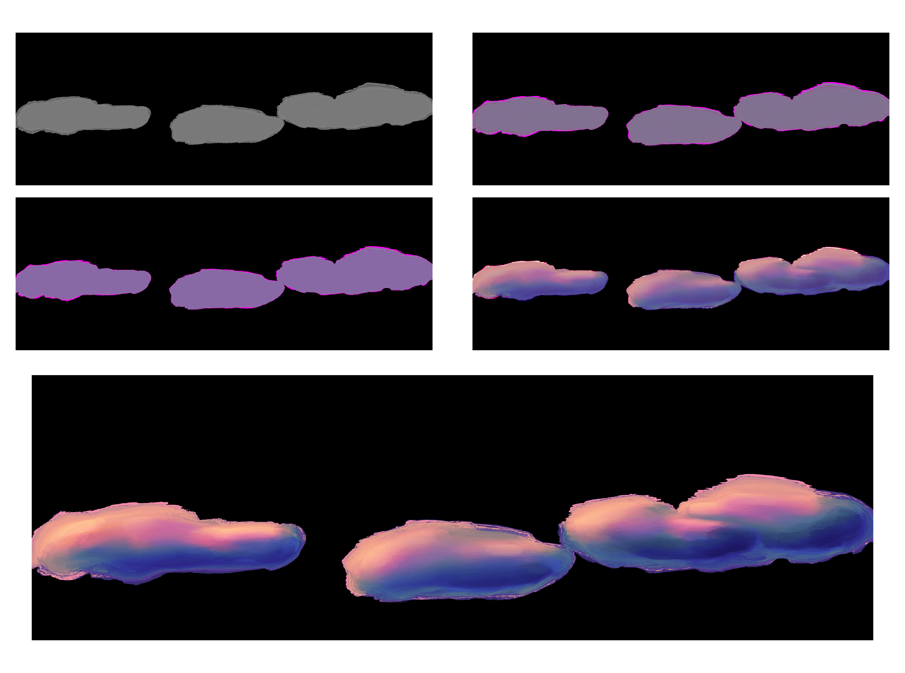

DOCUMENTATION


- [Short Discription](#short-discription)
- [November](#november)
  - [First idea and concept](#first-idea-and-concept)
  - [Idea development](#idea-development)
  - [Best Practice Examples](#best-practice-examples)
  - [Update Concept 30. November](#update-concept-30-november)
- [December](#december)
  - [Mid-term presentation](#mid-term-presentation)
  - [Concretization and visualization](#concretization-and-visualization)
  - [First sketch](#first-sketch)
- [January](#january)
  - [Start Coding](#start-coding)
  - [Viewport, Background and Camera](#viewport-background-and-camera)
  - [Collider](#collider)
  - [Group in p5 play](#group-in-p5-play)
  - [Player](#player)
    - [Mask](#mask)
    - [Player Movement](#player-movement)
  - [End of Projectweek](#end-of-projectweek)
  - [Distancing](#distancing)
  - [GUI](#gui)
    - [Display Scores/Buttons](#display-scoresbuttons)
    - [Feedback through color](#feedback-through-color)
    - [Pause](#pause)
  - [Second Background](#second-background)
  - [Scoring System](#scoring-system)
    - [Hygiene](#hygiene)
    - [Isolation and Zoom](#isolation-and-zoom)
  - [Rain](#rain)
  - [The version at the end of January](#the-version-at-the-end-of-january)
- [Feburary](#feburary)
  - [Animations and Illustrations | 2. - 16. Feburary](#animations-and-illustrations--2---16-feburary)
    - [Backgrounds and Clouds](#backgrounds-and-clouds)
    - [Player](#player-1)
    - [Single Contacts](#single-contacts)
    - [Distancing Groups](#distancing-groups)
    - [Others](#others)
  - [Embedding in the game | 16 Feb - 20 Feb](#embedding-in-the-game--16-feb---20-feb)
    - [Embedding the player animation](#embedding-the-player-animation)
  - [Creation of the screens (Digital Media Area)](#creation-of-the-screens-digital-media-area)
  - [The version until February 20](#the-version-until-february-20)
  - [Revision of the embedding of the illustrations](#revision-of-the-embedding-of-the-illustrations)
  - [Insert flickering light](#insert-flickering-light)
  - [Sounds](#sounds)
  - [Starting Screen](#starting-screen)
  - [Explaining Page](#explaining-page)
  - [User-Information](#user-information)
  - [Revision of the buttons/icons](#revision-of-the-buttonsicons)
  - [Status after February](#status-after-february)
- [March](#march)
  - [Structure code](#structure-code)
  - [Improve little things](#improve-little-things)
    - [Colors of Score Displays](#colors-of-score-displays)
    - [Icons explaining Score Changes](#icons-explaining-score-changes)
    - [Level volume](#level-volume)
    - [Scoring System](#scoring-system-1)
    - [Feedback Icons](#feedback-icons)
  - [Try and test Github Pages](#try-and-test-github-pages)


# Short Discription

At the beginning of the project the plan was to develop a storytelling website about philosophy and religion. These very daring plans have become concrete in the last weeks. The subject area was narrowed down to the - still philosophical - topic of freedom. Due to the current restrictions caused by the Corona virus, many discussions about "freedom" have been started. How much freedom do I have to give away? Is it a violation of personal freedom or the freedom of others if I follow or break certain rules? A **balance between individual freedom and the freedom of the collective** follows. Based on this topic, a game-like application will be developed, which resembles a kind of simulation on the one hand and a puzzle principle on the other. The game will be implemented with **p5 and the p5.play library**.

The player finds himself in a world in which he can move freely. Two values are displayed to the player: *Individual Freedom* and *Collective Freedom*. The values change depending on how the player moves in the world. After a while of trial and error, the player should figure out how the values are affected and can specifically try to achieve a certain score. There are six objects/areas in the world, which are meant to symbolize Corona-related limitations: *Mask, Single Contacts, Distance, Hygiene Regulation, Isolation, Zoom*. The six interactions were arranged differently in space. Here, the Y-axis reflects the differences in individual freedom (Top: flying, many contacts, sky -> much freedom. Bottom: Isolation, basement -> little freedom). The room has three different floors and is altogether larger than the viewport. Different value changes are planned for the interactions and through affordance/signifier and feedback the player should understand which objects are interactive.


The overall style is intended to appear dreamy and abstract, and the six interaction areas are intended to be represented metaphorically. (For example, the mask appears like a small cage around the player -> see image) The look and feel was made vivid in a moodboard:


The design of the game changes depending on how high the current values are. At a high collective value the background becomes more detailed and at a high individual value the player's image becomes more detailed. Thus the "value of freedom" is directly reflected in the visualization. 


Finally, the game can end up in four different scenarios: Both values are at 100%, One value is at 100% and the other is below 10% (and vice versa), Both values are below 10%. The game starts at 50% for both values. For each ending, a theoretical background on individual and collective freedom and the user's choices should be displayed.


____


# November

## First idea and concept 

* Website that combines scrollitelling content and the genre of "interactive film“.
* topic: philosophical/religious topics, such as God, morality, soul/the "I" etc. (Maybe just one topic for the project, because otherwise it would be too elaborate. Epistemology possibly with visualization of the Höhlengleichnis or morality with the Trolly problem)
* Visualization of philosophical theories 
* Target group: Children 
* Goal: To show children the issues of that there are different realities and truths. Categorizations into right and wrong are subjective.

* Since in schools and at home often only one point of view is taught
During the scrollitelling and at the end of each path, information should be displayed that shows how different philosophical currents or religions stand on the topics
* Vector-based style for animation. Similar to "in a nutshell


## Idea development

* *Example topic* | **Digitalization**: Designing time - acceleration through digitalization // Why are so many people passively engaged with digital media, even though we lose time because of it (and everyone complains about having little time). // Experiment: Taking away a sense - Interview only (audio) vs Interview (video and audio): Which seems longer? // Solution: A mindfulness smartphone // By taking out stimuli, can you reduce addiction? Without removing functions?
* *Example topic* | **Death**: the representation of death (visualization of something not visible) in animations // "Being dead" is in language a being. So an existing state. So in general death is seen as a kind of being?
* *Example topic* | **Empathy**: Animation film: an artificial-human machine, more human than a non-sentient human due to acceleration?
Example theme aesthetics: aesthetics as meaning of life. Reflecting as meaning. The beauty and the aesthetic sensation. Why? Because it is something unimportant for us/not important for survival and yet we see the value/desirable. Is it that what distinguishes humans from animals? That which goes beyond us and we do not understand but still somehow recognize.
Or a game, which shows you all your effects (maybe you are in everyday life and everything you do gets more points and these points turn out in the end as an ecological footprint) points system of *the good place*, maybe also as a preoccupation with the question of freedom. Your freedom must include the freedom of others -> very exciting under current considerations of corona. People go to demonstrate against Corona, because they feel their freedom is affected, but it is about the freedom of all. -> In the Corona game it could start in a color world and the more colors are added, the more one pays attention to the freedom of the others in the decisions, so that in the end a life comes about that is much more colorful and "free" by understanding freedom as a collective concept. The big theme is "freedom" and it is demonstrated by the example of Corona // All in all because of the question why persons decide to be Corona opponents and act so self-centered. As if freedom is only related to one's own person.
The game has two endings: once joined a conspiracy theory and once stayed at home (score how many people you infected (too macabre?))
Using 2d and 3d?
Maybe it is just one scene like a puzzle and more details get added the closer you get to the solution (like an interactive movie and the hint if you do something right or wrong is the amount of detail in the scene) -> like realizing what is true and what not (cave equation ) -> The background stays the same as we scroll and new UI elements 
pop up and the background is transitioning -> If I make a mix with a real story the protagonist doesn't have to be like a human being, it can be a shape as well 

## Best Practice Examples

* Beautiful website example style: lusion.co
* cineShader: https://cineshader.com
* https://molleindustria.org/demsocsim/
* Simulatot/Chain reactions
* https://ncase.me/polygons/
* https://github.com/periode/politics-of-code/blob/master/assets/readings/04-modeling/RhetoricVideoGames.pdf
* https://www.molleindustria.org/
* Every day the same dream: good example 
* A game in which you can only use the arrow-keys and spacebar for interaction (vertical scrollitelling) of a story which is a loop but u need to to something differently to get further


## Update Concept 30. November

* Topic: Interactive visualization of the dependency of freedom between individual and collective -> Freedom as a thought that does not depend only on one subject, because freedom is a game between own freedom and letting others have freedom
* Best Practice: Every day the same dream // democratic socialist // Grow
* Principle: User can make decisions that influence two values (freedom collective and freedom individual) -> The goal is to get both values balanced over a certain minimum, the decisions influence the values and the values influence the other value 
* Topic can be transferred to today's topic with Corona and a decision would be for example to wear masks
* Scenery is like in the Best Practice example an everyday scene, which contains about
5 screen widths and the decisions to be made have to be found 
Web-based it should be and you go through vertical scrolling and you can click the interactive states 
* Design: Preferably rather abstract (like Pierre's example with the triangles and squares), but the two values should be visually recognizable by the richness of detail of the subject and the background


* Advanced: if decisions were made, they might also change the gaming behavior perhaps. For example, when a mask is put on, the subject becomes faster or something like that
* things that you can interact with -> different „states“ that influence the two values -> mask (metaphor like maybe a cage, slowing someone down
  * -> seeing people (where you stand, being next to someone else)
  * -> washing/disinfecting hands (something that you have to do like every 1 minute)


____


# December

## Mid-term presentation

In November I developed the concept further and narrowed it down a lot. While at the beginning of the semester the plan was to create a scrollitelling website about philosophy and religion, the plan became more concrete in November. I also prepared [presentation](./presentations/mid-term-presentation.pdf) for the mid-term presentation.


## Concretization and visualization 

In December, I started sketching and planning the scene for the game. I came up with various interactions and integrated them into the scene. 
I created the following list that visualizes the interactions - and their impact:


 


I have also created the [Project Plan](./Timetable.md). Matching the project plan, I listed all [To-Dos](./To-Do.md) for a better overview. For goal setting, we defined the [Best and Worst Case Scenarios](./Best_Worst_Case.md).


I decided to create the game with the p5-play-library, because it should be a game that can be played in the browser. The rest of december I used to work with the [p5-play-library](https://molleindustria.github.io/p5.play/). During the whole project I used these three documentations all the time:
* [molleindustria](https://molleindustria.github.io/p5.play/examples/index.html)
* [creative coding](https://creative-coding.decontextualize.com/making-games-with-p5-play/)
* [code.org](https://code-dot-org.github.io/p5.play/docs/modules/p5.play.html)

## First sketch


____


# January

## Start Coding

On the first day of the project week, I first created a Github repository and connected it to my visual studio code. After that I downloaded the p5.play-library and created my file.

In January during the project week I had the conception of the project mostly ready, so I sat down to the code for the first time. Since it is my first big coding project, I tried to make a plan for the project week. The sequence of the project was as follows:

- Create scene
- Insert background 
- Add camera 
- Add all interactive elements 
- Player Movement
  
After the first day of the project week, my sketch looked [like this]((../sketch-jan-5.js)):


## Viewport, Background and Camera

In January I started working on the code. The first thing to do was to create the game world. For this the previously created [drawing](./media/bg-test-6.png) was used as background image.


```javascript
function preload(){
    bgImg2 = loadImage("../img/BG-2.png");
} 
function setup() {
    createCanvas(windowWidth, windowHeight);
}
function draw() {
    background(bgImg2);
}
```

Since the viewport `createCanvas(windowWidth, windowHeight);` should be smaller than the whole scene `bg = createSprite(0, SCENE_H/2, SCENE_W, SCENE_H);`, I created a *sprite* for the background, to which I could add different images. With a virtual camera it was then possible to determine the section which is visible. This section was then linked to the behavior of the player, so that the player always stays in the middle of the viewport - unless the player gets too close to the edge of the screen, then the camera stops.


```javascript
let SCENE_W = 4000;
let SCENE_H = 3000;

function preload(){
    bgImg2 = loadImage("../img/BG-2.png");
} 
function setup() {
    createCanvas(windowWidth, windowHeight);

    bg = createSprite(0, SCENE_H/2, SCENE_W, SCENE_H);
    bg.addImage(bgBigImg1);
}
function draw() {
    camera.zoom = 1;
    ...
    let ScreenPlayerRelation = width/2;
    if (player1.position.x >= EDGE_R - ScreenPlayerRelation){
        camera.position.x = camera.position.x;
    }
    ...
    else{
    camera.position.x = player1.position.x;
    }
    ...
}
```


## Collider

For all platforms and other objects the player can interact with, I created more *sprites*. Sprites were created for the following objects:
* Ground (collider with player)
* Middle platform (collider with player)
* Stairs (Collider with Player)
* Flying Area (Overlapping with player changes score)
* Gravity Area (Overlapping with Player sets Gravity)
* Teleport Area 1 and 2 (Overlapping with Player changes player.position)
* Mask (Overlapping with player changes score)
* Hygiene Area (Overlapping with player changes score)
* Zoom Area (Overlapping with player changes score)
* Isolation Area (Overlapping with player changes score)
* Individuals (score is changed by overlapping with player)
* Group persons (score is changed by overlapping with player)
Most *sprites* remain invisible in the game.


```javascript
function setup() {
    ...
    ground = createSprite(0,SCENE_H,SCENE_W,50);
    middleGround = createSprite(0,(SCENE_H/3)*2,SCENE_W,20);
    ...
    flyingArea = createSprite(0,(SCENE_H/6),SCENE_W,SCENE_H/3);
    flyingArea.visible = false;
    gravityArea = createSprite(0,(SCENE_H)-(SCENE_H/3),SCENE_W,SCENE_H/1.5);
    gravityArea.visible = false;
    ...
}
function draw() {
    ...
    if (player1.overlap(flyingArea)){
    flying();
    }else{
    gravity = 1;
    }
    ...
    if(player1.collide(ground) || player1.collide(middleGround)) {
    player1.velocity.y = 0;
    }
    ...
}
```
## Group in p5 play

For the individual contacts and for the distancing groups, p5-play groups had to be created. This way many elements could be given the same attributes. For the different interaction elements I created functions, like here `singlePeopleWalking()` .

```javascript
function setup() {
    ...
    singlepeople = new Group(); 
    for (let i = 0; i < 5; i++){
        s1 = createSprite(random(SCENE_W)-(SCENE_W/2),heightSinglePerson,200,100);
        s1.friction = random(0.001, 0.05);
        s1.shapeColor = color(200,0,50);
        s1.maxSpeed = 12;
    singlepeople.add(s1);
  }
    ...
}
function draw() {
    ...
    singlePeopleWalking ();
    ...
}
function singlePeopleWalking(){
    directionSingle = random(1,10)
      for (let i = 0; i < singlepeople.length; i++){
        singlepeople[i].attractionPoint(0.12, SCENE_W, heightSinglePerson); 
        if (singlepeople[i].overlap(rightEdgeCollider)){
          singlepeople[i].position.x = -(SCENE_W/2); 
        }
      }
}
```


## Player

### Mask

A *sprite* was also created for the player, so that the player has a collider that provides the events when it touches the other colliders. However, since the player should look different depending on whether it wears a mask, several images were assigned to the *sprite*. Several boolean variables were then used to check whether the player was wearing the mask and whether he had touched the ground again since putting on the mask (because otherwise the mask would be on and off continuously for the entire time the player was touching the mask). Throughout the code for the game, I then very often used this Boolean logic to trigger events only once (in a given) in the draw loop.



```javascript
function preload(){
    playerImg = loadImage("../img/woman.png");
    playerMaskImg = loadImage("../img/mask.png");
} 
function setup() {
    ...
    player1 = createSprite(0,0);
    player1.addImage(playerMaskImg);
    player1.addImage(playerImg);
    ...
}
function draw() {
    ...
    maskOnOff();
    ...
}
function maskOnOff(){
    //put on mask
    if(player1.overlap(maskPosition) && !maskOn && maskGroundCheck){
        player1.addImage(playerMaskImg);
        maskGroundCheck = false;
        maskOn = true; 
    }
    //Ground Check
    else if(player1.overlap(invisibleGroundCheck) && maskOn && !maskGroundCheck){
        maskGroundCheck = true;
    } 
    //put off mask
    if (player1.overlap(maskPosition) && maskOn && maskGroundCheck){
        player1.addImage(playerImg);
        maskGroundCheck = false;
        maskOn = false;
    }
    //Ground Check
    else if(player1.overlap(invisibleGroundCheck) && !maskOn && !maskGroundCheck){
        maskGroundCheck = true;
    }
}
```

### Player Movement


To make the player move, I programmed the player movement in the Gravity-Area on the one hand and in the Flying-Area on the other hand. To change the position of the player only the `player1.position.x` had to be changed at for example `keyIsDown(RIGHT_ARROW)`. For flying, this was allowed in all four directions. For jumping the `player.velocity.y` had to be changed. Again a GroundCheck with a Boolean variable was used, so that the player cannot jump continuously.

```javascript
...
function draw() {
    ...
    if (player1.overlap(flyingArea)){
        flying();
    }else{
        gravity = 1;
    }
    ...
    //Jumping
    if(keyWentDown(' ') && playerGroundCheck && player1.overlap(gravityArea)){
        player1.velocity.y = -jump;
        playerGroundCheck = false;
    }
    ...
}
function flying(){
    ...
    gravity = 0; 
    if (keyIsDown(UP_ARROW)) {
        player1.position.y -= 10;
    }
    if (keyIsDown(DOWN_ARROW)) {
        player1.position.y += 10;
    }
    ...
}
```

## End of Projectweek 

After the project week the basic functions and the basic scene were coded. [Here](../sketch-jan-10.js) is the state of my sketch after the project week and [this](./media/video-jan-8.mp4) is a video of the game at that time.


## Distancing 

Especially with the programming for the distancing function I had great difficulties. For this, a group should be created that follows an attraction point. The attraction point should be invisible afterwards, so that it looks like the group is moving in swarms. With one group it worked relatively fast, but there were many problems and failed attempts to create multiple groups following different points. 
The first version looked like this: 


https://molleindustria.github.io/p5.play/examples/index.html?fileName=sprite4.js

```javascript
function setup() {
    ...
    attraction1 = createSprite(random(width),height/2,20,20);
    distanceCharacter = new Group();
   
    for (let i = 0; i < 20; i++ ){
        c1 = createSprite(random(width), random(height), random(20,50), 20);
        c1.shapeColor = color(20,20,20);
        c1.maxSpeed = 12;
        c1.friction = random(0.05, 0.15);
        c1.rotateToDirection = true;
        distanceCharacter.add(c1);
    }
    ...
}
function draw() {
    ...
    distancingFunction();
    ...
}
function distancingFunction(){
    ...
    //Limiting area where attraction-points move
    if (attraction1.position.x  > EDGE_R){
        directionOfAttractionX = random(-4,-1);
    }
    ...

    attraction1.position.x += directionOfAttractionX;
    attraction1.position.y += directionOfAttractionY;

    //direction and speed of attraction character
    direction += random(1,5); 
    attraction1.setSpeed(random(2,3), direction); 

    for (let i = 0; i < distanceCharacter.length; i++ ){
        distanceCharacter[i].attractionPoint(0.12, attraction1.position.x, attraction1.position.y);
        distanceCharacter[i].setCollider("circle", 0, 0, 20);
        distanceCharacter.collide(distanceCharacter[i]); 
    } 
}
```

To create multiple groups I had to make many attempts. In some versions the attraction points always moved in the same way or the groups followed only one point. To solve the problem that the attraction points do not always move the same way (i.e. in the same direction), I created a class `class Attraction_points`. So each object of the class has its own attributes.

```javascript
let distancing_groups = [];
let att_points = [];
let total_number_of_groups = 6;
let amount_of_characters = 40;

function setup() {
    ...
    for (let i = 0; i < total_number_of_groups; i++){
        distancing_groups[i] = new Group();
        att_points[i] = new Attraction_points(random(-SCENE_W/2, SCENE_W/2), random(SCENE_H/3), random(-2,2), random(-2,2));
        createSwarm(distancing_groups[i], att_points[i].positionX, att_points[i].positionY);
    }
    ...
}
function draw() {
    ...
    for (let i = 0; i < total_number_of_groups; i++){
    att_points[i].move();
    swarmFollowAttraction(distancing_groups[i], att_points[i].positionX, att_points[i].positionY);
  }
    ...
}

// CREATING SWARM
function createSwarm(distancing_group, attraction_pointX, attraction_pointY){
  for (let e = 0; e < amount_of_characters; e++ ){
    c1 = createSprite(...);
    ...
    c1.attractionPoint(29, attraction_pointX, attraction_pointY);
    distancing_group.add(c1);
  }
}

// SWARM FOLLOWS ATTRACTION POINT
function swarmFollowAttraction(distancing_group, attraction_pointX, attraction_pointY){
  
  for (let i = 0; i < amount_of_characters; i++){
    distancing_group[i].attractionPoint(random(0.08, 0.2), attraction_pointX, attraction_pointY);
    distancing_group[i].setCollider("circle", 0, 0, 20);
    distancing_group.collide(distancing_group[i]);
  }
  ...
}

// CREATING AND MOVING ATTRACTION POINTS
class Attraction_points {
  constructor(posX, posY, speedX, speedY){
      this.posX = posX;
      this.posY = posY;
      this.speedX = speedX;
      this.speedY = speedY;
  }

  get positionX (){
    return this.posX;
  }
  get positionY (){
    return this.posY;
  }

  move(){
    if(this.posX <= -(SCENE_W/2)){
        this.speedX = random(minSpeed,maxSpeed);
    }else if(this.posX >= SCENE_W/2){
        this.speedX = random(-maxSpeed,-minSpeed);
    }
    ...
    this.posX += this.speedX;
    ...
  }
}
```


## GUI

### Display Scores/Buttons

For the userinterface elements the camera had to be turned off with `camera.off()`, so that the elements on the canvas are shown absolutely and not relatively in the game world. The buttons and elements I added with simple p5 functions like `rect` or `ellipse`. To change the colors of the scores depending on how high the score is, I used the `map()` function to store varibbles that store targeted color values for the score interval from 0-100.


```javascript
function draw() {

    ...

    camera.off();

    ...

    let m = map(individualScore, 0, 100, 20, windowWidth/5);
    let c1 = map(individualScore, 0, 100, 250, 0);
    let c2 = map(individualScore, 0, 100, 0, 200);
    let c3 = map(individualScore,0, 100, 100, 150);

    ...

    noStroke();
    fill(c1,c2,c3);
    rect(20,20, m, (windowWidth/5)/4, r); //individual 

    ...

    camera.on();
}

```

### Feedback through color

To give the user feedback when the score changes positively or negatively, I created the variables `fbS_I_r` (feedbackScore_Individual_red) etc. for the word `individual` and `collective` as well as for the contour of the score image. For events in which the scores change, one of the four functions `feedbackUpScoreI()`,`feedbackDownScoreI()`,`feedbackUpScoreC()`,`feedbackDownScoreC()` is then called, coloring the corresponding score either red or green. After 500 milliseconds of action, the color values are reset. For this, use was made of the `setTimeout()` function, which I used again several times later.

```javascript
function draw() {
    ...
    camera.off();

    ...

    stroke(fbS_I_r, fbS_I_g, fbS_I_b);
    strokeWeight(3);
    noFill();
    rect(20,20, windowWidth/5, (windowWidth/5)/4, r); //individual

    ...

    fill(fbS_I_r, fbS_I_g, fbS_I_b);
    textAlign(CENTER);
    textSize(windowHeight/40);
    text("Individual", 20 + windowWidth/10, 20 + windowWidth/35);

    ...

    camera.on();
}

function feedbackUpScoreI(){
    fbS_I_g = 200;
    fbS_I_b = 150;
    setTimeout(function(){fbS_I_g = 0; fbS_I_b = 0;}, 500);
}

```


### Pause
For the pause button function, I packed the entire contents of the draw function into an if-condition. When the button is pressed, I then set this condition to false so that the game cannot continue to run. Since the `mousePressed()` function I use to flip the boolean is outside the `draw()` function, the condition can be set back to true and the game continues.

```javascript
let running = true;

function mousePressed(){
    if(mouseX > 20 && mouseX < 20 + windowWidth/10 && mouseY > windowHeight - (windowHeight/10) && mouseY < windowHeight - (windowHeight/20)) {
    running = !running; // flip the boolean
    ...
}
function draw() {
    if(running){
        ...
    }
}
```


## Second Background 

To create an illusion of depth, I decided to have the foreground and background move differently. So it appears that the foreground is closer to the player. The background (`bg_back`) now moves relative to the position of the player. However, to prevent the edge of the back image from protruding into the viewport when the player is at the edge of the playfield, the background image must be larger than the foreground. While the illustrations for the foreground should be 4000x3000px, the background must be 4300x3000px.

```javascript
function setup(){
    bg_back = createSprite(0, SCENE_H/2, SCENE_W, SCENE_H);
    bg = createSprite(0, SCENE_H/2, SCENE_W, SCENE_H);
    }
function draw() {
    for(let i = -1910 ; i < player1.position.x; i++){
        bg_back.position.x = -(i/10);
    }
}
```


## Scoring System

Now that all the interactive elements have been added, the influences of these on the scoring system had to be inserted. 

### Hygiene

I coded many influences on the score by the `overlap()` method available in the p5-play-library. If the player is within a certain area, the score is affected accordingly. For a one-time boost, like in the hygiene area, I added a boolean varibael so that it only applies once. When leaving the area, the varibael is reset with `setTimeout()` after 20000 milliseconds, so that a new boost can take place.

```javascript
function draw() {
    hygieneScore();
}

function hygieneScore(){
    if (player1.overlap(hygieneArea) && boostHygine === false){
      boostHygine = true;
      feedbackUpScoreC();
      feedbackDownScoreI();
      collectiveScore += 20;
      individualScore -= 10;
    }else if (player1.overlap(hygieneArea) === false && boostHygine && !hasStartedTimeoutH){
      hygieneBoostIntervall = setTimeout(function(){boostHygine = false; hasStartedTimeoutH = false;}, 20000); 
      hasStartedTimeoutH = true;
    }
}
```

### Isolation and Zoom

Some values should not change statically, but for example should increase/decrease more and more. For example, when staying in the isolation area, the individual value should decrease more if the player has been there for a longer time. For this I introduced a variable `lonely`, which indicates how lonely the player already is. 1 would be in this case not lonely and 10 very lonely. The value is multiplied by 0.001 throughout, so that it increases faster and faster. 

```javascript
function draw() {
    isolationScore();
}
let lonely = 1; //1= not lonely ; 10 = very lonely
function isolationScore(){
    let insideIsolationArea;
    if (lonely <= 1){lonely = 1;}else if(lonely >= 10){lonely = 10;}
    if (player1.overlap(isolationArea)){
        insideIsolationArea = true;
    }else{
        insideIsolationArea = false;
    }
    if (insideIsolationArea){
        feedbackDownScoreI();
        lonely *= 1.001;
        individualScore -= lonely * 0.001;
        collectiveScore += lonely * 0.001;
    }else{
        lonely *= 0.999; 
    }
}
```

The same principle is used to influence the score within the zoom range. In this case the variable `boring` was introduced.


## Rain 
For disinfection, it should rain symbolically on the right side of the game world. When touching the rain, the player is thus disinfected. For this I have modified the code [from this page](https://editor.p5js.org/monicawen/sketches/HkU-BCJqm) and inserted it into my code.


## The version at the end of January
By the end of January, I had all the basic functions ready. It was especially difficult to get the distancing function with all the swarms done. My sketch looked [like this](../sketch-feb-2.js) after January.


# Feburary

## Animations and Illustrations | 2. - 16. Feburary

The creation of all illustrations and animations took over 2 weeks in February. An overview of all necessary illustrations can be found [here](./To-Do.md) under animations. 

I created the illustrations with [procrate](https://procreate.art) on my tablet and exported them as png files. 

### Backgrounds and Clouds 

For the background of the game world I created an illustration (4000x3000px). Since I wanted the background to move differently from the foreground, I had to make two separate illustrations. Additionally I made 5 different detailed illustrations for the clouds, because the clouds move independently from the background. Furthermore, I created the game world in five different levels of detail: 




### Player

For the player figure I decided to use a bubble animation. Since the whole game is supposed to be rather symbolic and abstract, a non-human figure seemed appropriate to me. The bubble loses a small bubble in an animation cycle. This process is meant to symbolize human breathing. When the player wears a mask, the little bubble is smaller. I have an animation for the player with and without a mask with one time with shadow and one time without shadow. The animation without shadow should play when the player jumps or flies. I created these four different animations for all 5 detail levels, so I created 20 different player animations. Since each animation consists of 11 frames, I created a total of 220 frames for the player.


### Single Contacts

For the single contacts, I made five animations each for those going to the right and five for those going to the left. The animations could not simply be mirrored because the highlights would have been mirrored otherwise. The animation cycles for the single contacts consist of 10 frames.


### Distancing Groups

For the group contacts (swarms in the sky) I also made animations. The groups should consist of three different colors and each animation comprised 7 frames. When implementing the animations in the sketch, it slowed down the game a lot - probably due to the high number of *sprites* - so I decided to use only frames instead of aniamtions. 


### Others

For the favicon I used a modified and optimized version of one of the player illustrations.


Since I wanted the zoom/digital media areas to resemble a glowing screen, I also decided to use procreate to illustrate soft-drawn "lights". 

In total I have:
* 5 illustrations for the background
* 5 illustrations for the foreground 
* 5 illustrations for the clouds
* 220 illustrations for the player character
* 100 illustrations for the single contacts 
* 105 illustrations for the group contacts
* 4 illustrations for the lights 
* 1 illustration for the favicon 
created. So 445 illustrations in total. 
I tried to keep all illustrations as small as possible to keep the amount of data as small as possible.


## Embedding in the game | 16 Feb - 20 Feb

After I created all the illustrations and animations, I started to embed the illustrations into the game. Before that I used a lot of placeholder images - but it the planned dimensions - to test if the way I create the files is compatible. 

### Embedding the player animation
To find out how to embed the animations correctly, I followed [this](https://molleindustria.github.io/p5.play/examples/index.html?fileName=animation.js) page. 
* In `preload()` all images are loaded first. For this only the first and last frame must be named, all in between are added automatically (if numbered correctly).
* In `setup()` the animation is assigned to a *sprite*.
* In `draw()` the animations can be changed.
I have embedded the animations as follows:

```javascript
function preload(){
    ...
    player_1_jump_animate = loadAnimation('../img/player/Player-SW-Jump-1.png','../img/player/Player-SW-Jump-11.png');
    player_1_ground_animate = loadAnimation('../img/player/Player-SW-Ground-1.png','../img/player/Player-SW-Ground-11.png');
    ...
}
function setup(){
    ...
    player1.addAnimation('player_1_ground_animate','../img/player/Player-SW-Ground-1.png','../img/player/Player-SW-Ground-11.png');
    ...
}
function draw(){
    ...
    if(individualScore < 20){
        player1.changeAnimation('player_1_ground_animate');
    }else if(individualScore > 20 && individualScore < 40){
        player1.changeAnimation('player_2_ground_animate');
    }
    ...
  
}
```

## Creation of the screens (Digital Media Area)

In the zoom or digital media area I wanted to create an illusion of a glowing screen. In the image area of the screen an animation should play. I wanted to create the animation with p5, on the one hand to save memory (and loading time) and on the other hand to give it a digital style. For this I used the `createGraphics()` function. I could then treat this graphic like a custom canvas and project a new sketch onto it. I then assigned values to the new graphic in a function `graphicsScreen()` and created a simple animation with it. I could then call the function in `draw()` several times for all screens and assign different sizes and colors.

```javascript
function setup(){
    ...
    zoomScreenGround = createGraphics(125,125);
    ...
}
function draw(){
    ...
    for(let i = 0; i<301; i += 150){
        for(let y = 0; y < 1000; y += 980){
            graphicsScreen(zoomScreenGround, -1015+y, 2215+i, 125, 125,0, 0, 100, 150);
        }
    }
    ...
  
}
function graphicsScreen(graphics, x, y, w, h, bg, r, g, b){
    ...
      graphics.rectMode(CENTER);

      if(move1 <= 500){
          for(let i = 0; i < 600; i+=50){
            graphics.rect(w/2,h/2,move1-i,move1-i); 
          }
          for(let i = 0; i < 500; i+=50){
          graphics.rect(w/2,h/2,move1+i,move1+i);
          }
      }else{
        move1 = 50;
      }
      
      move1 += 1;
      image(graphics, x, y);//Ort
  }
```


## The version until February 20

Until February 20, my sketch looked [like this](../sketch-feb-20.js). A video can be found [here](./media/video-feb-20.mp4).


## Revision of the embedding of the illustrations

After the first attempt to embed the animations, the image stuttered a lot and the load time increased drastically. So I tried a bit and finally embedded the animations so that they are only loaded in preload and then called in draw. This way the setup step was skipped. At the beginning of `draw()` all possibilities (score, jump, mask etc.) are now weighed and the appropriate animation/illustration is displayed:

```javascript
function preload(){
    ...
    bg_vorne_1 = loadImage('../img/bg-vorne-1.png');
    bg_hinten_1 = loadImage('../img/bg-hinten-1.png');
    ...
    player1.addAnimation('player_1_jump_animate', '../img/player/Player-SW-Jump-1.png','../img/player/Player-SW-Jump-11.png');
    player1.addAnimation('player_1_ground_animate','../img/player/Player-SW-Ground-1.png','../img/player/Player-SW-Ground-11.png');
    ...
}

function draw(){
    ...
    if (collectiveScore < 20){ 
        bg_back.addImage(bg_hinten_1);
        bg.addImage(bg_vorne_1);
        bg_clouds1.addImage(clouds_1_img);
        bg_clouds2.addImage(clouds_1_img);
        s1.changeAnimation('singleContact_1_R_animate');
        s2.changeAnimation('singleContact_1_L_animate');
    }else if
    ...
    if(individualScore < 20){
        if(maskOn && playerGroundCheck){
            player1.changeAnimation('player_1_mask_jump_animate');
        }else if(maskOn && !isJumping){
            player1.changeAnimation('player_1_mask_ground_animate');
        }else if(!maskOn && isJumping){
            player1.changeAnimation('player_1_jump_animate');
        }else if(!maskOn && !isJumping){
            player1.changeAnimation('player_1_ground_animate');
        }
    }else if
    ...
  
}
```

## Insert flickering light
To achieve the illusion of a glowing screen in the zoom area, I made two illustrations for each of the two areas (zoom area in the middle layer and zoom area in the bottom layer). These are simply white, blurred areas around the screen with two degrees of transparency. Using a random variable between 0 and 1, I then randomize the images in `draw()` to create a flicker effect:

```javascript
function preload(){
    ...
    lights_oben_img = loadImage("../img/lights-oben.png");
    lights_unten_img = loadImage("../img/lights-unten.png");
    lights_oben_2_img = loadImage("../img/lights-oben-2.png");
    lights_unten_2_img = loadImage("../img/lights-unten-2.png");
    ...
}

function draw(){
    ...
    push();
        let randomizer = random(1);
        if(randomizer > 0.5){
            image(lights_unten_img,-SCENE_W/2,0);
            image(lights_oben_img,-SCENE_W/2,0);
        }else{
            image(lights_unten_2_img,-SCENE_W/2,0);
            image(lights_oben_2_img,-SCENE_W/2,0);
        }
  pop();
    ...
}
```


## Sounds

For the auditory background of the game I picked out sounds from [Soundbible](https://soundbible.com) and [Audiohub](https://audiohub.de), downloaded and implemented them. The music should provide a specific mood. At the same time, it is also an indicator for the change of statuses in the game. Since a different music is played in the upper and lower image areas, the player should notice that the image areas have an influence on the game. The other sounds are also supposed to serve as feedback as soon as the player causes a change in the score. A button and jump sound should also serve as feedback for an interaction. I needed the following sounds:

* **Music for the upper screen area** | The music should have a positive and relaxing effect. The upper area represents the individual feeling of freedom, which is why the player can fly there. 
* **Music for the middle image area** | The music should have a relatively neutral effect and still provide a mood of optimism. It is the music that is also played at the beginning of the game, so it should be motivating.
* **Music for the lower screen area** | The music should sound a bit more aggressive and constricting. It is the music that is played in the isolation area.
* **Rain sounds**
* **Mask on/off sound**
* **Teleporting sound**
* **Swoosh when walking past people**.
* **Electricity sound for zoom area**
* **Jumping**
* **Button sound**

After I found suitable sounds, I embedded them directly into the game. The embedding was similar to the illustrations. In `preload()` all sounds are loaded and then called in draw at the appropriate action:

```javascript
function preload(){
    ...
    jump_sound = loadSound('../audio/jump.mp3');
    ...
    flyingArea_sound = loadSound('../audio/gone_short_audiohub.mp3');
    ...
}

function draw(){
    ...
    if(keyWentDown(' ') && playerGroundCheck && player1.overlap(gravityArea))
    {
      jump_sound.play();
      player1.velocity.y = -jump;
      playerGroundCheck = false;
    }
    ...
    if(player1.overlap(flyingArea) && !flyingAreaSoundOn){
        middleAreaSoundOn = false;
        flyingAreaSoundOn = true;
        flyingArea_sound.play();
    }
    ...
}
```

For the music in the Flying Area and the Isolation Area, I shortened the songs using [Adobe Premiere](https://www.adobe.com/de/products/premiere.html), since the player probably won't stay in the areas for more than a minute at a time anyway, and when it re-enters the areas, the songs start over again. This way I was able to save a little more memory. 
  

## Starting Screen 

Of course, when the user goes to the game's page, the game should not start immediately, but a splash screen should basically introduce the game. At the same time, the look and feel of the overall game should already be obvious. For the start screen, I therefore decided on the background for the sky (the background), in which the clouds pass by. The sky is symbolic of freedom and the word "freedom" is written large behind the clouds. So it is clear to the user from the beginning which theme the game is about. The images were loaded again in preload. I created the clouds with a *sprite*, which moves through the image from right to left. 

```javascript
function preload(){
    ...
    docu_bg_img = loadImage('../img/docu_bg.png');
    docu_clouds_img = loadImage('../img/docu_clouds.png');
    ...
}
function setup(){
    ...
    docu_clouds = createSprite(0,0,windowWidth,windowHeight);
    docu_clouds.addImage(docu_clouds_img);
    ...
}

function draw(){
    if(startingPage){
        if(!middleAreaSoundOn){
            middleAreaSoundOn = true;
            middleArea_sound.play();
        }
    
        push();
            background(docu_bg_img);
            ...
            text("FREEDOM", windowWidth/2,windowHeight/2);

            ...

            docu_clouds.position.y = windowHeight/2;
            if (docu_clouds.position.x <= -900){
                docu_clouds.position.x = 2300;
            }
            docu_clouds.position.x -= 0.5;
            drawSprite(docu_clouds);
        pop();

      ...
    }
}   
```


## Explaining Page 

After the basic functions and animations were installed, I tested the game with a few people. Through this and in consultation with Pierre, we noticed that by starting the game immediately - without an introduction - confusion can arise. Therefore I created a second page, which should be displayed after the startingscreen. On this page a small introduction to the functions of the game is given. The order in `draw()` is accordingly as follows: 


```javascript
function draw(){
    if(startingPage){

        ...

        if(mouseIsPressed && mouseClickCheck){
            mouseClickCheck = false;
            setTimeout(function(){startingPage = false;explainPage = true;}, 100);
            setTimeout(function(){mouseClickCheck = true;}, 500);
        }
    }
    if(explainPage){

        ...

        if(mouseIsPressed && mouseClickCheck){
            mouseClickCheck = false;
            explainPage = false;
            running = true;

        }
    }
    if (running){
        ...

        removeSprite(docu_clouds);
        ...
        
    }
}
```


## User-Information

To allow even less confusion and to offer more information to the user, I also created an `updateUserInfo` variable. Information is now displayed at the top of the screen to match the user's current situation. The following information can be displayed:
* *You are wearing a mask*
* *You are not wearing a mask*
* *You met somebody*
* *You are desinfected*
* *You met a group of people*
* *You are using digital media*
* *Feel free to fly*
* *You entered your home*
  
The information is added in `draw()`:

```javascript
function draw(){
    ...
    textSize(windowHeight/40);
    fill(255);
    text(updateUserInfo, windowWidth/2, 20+(heightScoreDisplay/2)+(windowHeight/120));
    if(maskOn){
        updateUserInfo='You are wearing a mask';
    }else{
        updateUserInfo='You are not wearing a mask';
    }
    ...
}
```


## Revision of the buttons/icons 

At the end of February I reworked the buttons again, because I found icons more suitable. They are very quick to understand and - because they are not large - do not look so conspicuous. 
For this I found suitable icons on the page [flaticon](https://www.flaticon.com), downloaded them and imported them into the project. The icons are - like the illustrations - loaded in `preload()` and called in `draw()` via a separate function `displayIcons()`.

```javascript
function preload(){
    ...
    sound_icon = loadImage('../img/icons/volume.svg');
    sound_hover_icon = loadImage('../img/icons/volume-hover.svg');
    ...
}

function draw(){
    ...
    displayIcons(sound_icon,sound_hover_icon,windowWidth - windowWidth/20 - 20,windowHeight - (windowHeight/10));
    ...
}   

function displayIcons(img,img_hover,w,h){
    ...
    push();
      scale(0.1)
      let currentImg = img; 
      image(currentImg,w*10,h*10);
    pop();

    if(mouseX > w && 
      mouseX < w + (img.width)/10 && 
      mouseY > h && 
      mouseY < h + (img.height)/10){
        push();
            scale(0.1)
            image(img_hover, w*10,h*10);
        pop();
        if(currentImg === sound_icon){
            playPauseSound();
        }else if(currentImg === zoom_icon){
            zoomInOut();
        }
    } 
}
```


## Status after February

After February, my sketch looked [like this](./../sketch-march.js). A video of the version can be found [here](./media/video-march.mp4).


# March

## Structure code

Since the code has become very long and confusing in the meantime, I have organized and structured the code at the beginning of March. I made an [overview](./code_strukur.md) of all functions and code contents, so that I still understand the code even if I haven't worked on it for a long time.


## Improve little things 

### Colors of Score Displays

Since the colors for the feedback did not work properly and sometimes resulted in unwanted colors, like beige, I have reworked the functions again and added icons that clearly show whether an event has a positive or negative impact on the scores.

### Icons explaining Score Changes

To make clear which Events influence the Scores in which ways, I decided to create Icons as Feedback-Elements. The icons will be displayed next to the score in either red or green. Because if the icon the player is supposed to understand what element triggerd the event and because of the color he/she can understand if it had a positive or a negative impact on the scores. I created 12 icons with 64x64px:


 I wanted to display all icons that are currently influencing the scores. In order to do so it was very difficult to display the icons next to the scores without them overlapping each other. They were supposed to be displayed next to each other, so the position depended on how many icons were currently displayed. I coded a class to do that. So each icon is an object, which contains information. For each score I created an array, that contains all currently displayed icons as strings. The class `DisplayIcons_new` contains two methods for either pushing the string to the certain array or distracting a string from the array. Another method will display the icon based on the position of the `this.string` in the array.


```javascript
let arrayCheckMask= false;
let counterIconsIndividual = [];
let counterIconsCollective = [];

preload(){
    mask_red_icon = loadImage('../img/icons/mask-red.png');
    mask_green_icon = loadImage('../img/icons/mask-green.png');
}

 setup(){
    iconRedMask_C = new DisplayIcons_new(counterIconsCollective,mask_red_icon,windowWidth/5 + 30,30+(windowHeight/14)+(windowHeight/120), 'RED MASK');
    iconRedMask_I = new DisplayIcons_new(counterIconsIndividual,mask_red_icon,windowWidth/5 + 30,20, 'RED MASK');
    iconGreenMask = new DisplayIcons_new(counterIconsCollective,mask_green_icon,windowWidth/5 + 30,30+(windowHeight/14)+(windowHeight/120), 'GREEN MASK');
 }

 draw(){

    ...
    if(maskOn){
        iconRedMask_I.display(); //I
        iconGreenMask.display(); //C
        if(arrayCheckMask){
            iconRedMask_I.push();
            iconRedMask_C.pop();
            iconGreenMask.push();
            arrayCheckMask = false;
        }
    }else{
        iconRedMask_C.display();
        if(!arrayCheckMask){
            iconGreenMask.pop();
            iconRedMask_C.push();
            iconRedMask_I.pop();
            arrayCheckMask = true;
        }
    }
...

 }

class DisplayIcons_new{
    constructor(arr, image, width, height, string){
        this.arr = arr;
        this.image = image;
        this.width = width;
        this.height = height;
        this.string = string;
    }

  push(){
        this.arr.push(this.string);
  }

  pop(){
        this.arr.pop();
  }

  display(){
        push();
        scale(0.8);
            if(this.arr.indexOf(this.string) === 0){
                image(this.image,this.width*1.25,this.height*1.25);
            }else if(this.arr.indexOf(this.string)=== 1){
                image(this.image,(this.width*1.25)+80,this.height*1.25);
            }else if(this.arr.indexOf(this.string)=== 2){
                image(this.image,(this.width*1.25)+160,this.height*1.25);
            }else if(this.arr.indexOf(this.string)=== 3){
                image(this.image,(this.width*1.25)+240,this.height*1.25);
        }
        pop();
  }
}
 ```

  
### Level volume 
  
The music and sounds sounded disproportionately loud or quiet. So I used the `setVolume()` function to match all the sounds from volume to volume. It was important that all interaction/feedback sounds were loud enough so that they serve as a signal. 


### Scoring System 

I have revised the scoring system several times by playing the game and trying to reach all the endings so that no ending becomes impossible or too hard or too easy.

Changed all the values to variables, so I can adjust the scoring system in the global variables. Also I changes the mask-scoring-system. Instead of using setTimeout I change the value every loop.

add icon green mask for collective when wearing

```javascript
if(player1.overlap(distancing_group) && touchedGroup === false){
        ...
        //scoring-system
        individualScore += 10;
        collectiveScore -= 30;
        ...
    }

function setMaskOffInterval (){
    maskOffInterval = setInterval(function(){
      // SCORE CHANGE WHILE MASK IS OFF
      //scoring-system
        individualScore += SS_MASK_I; 
        collectiveScore -= SS_MASK_C;
    },500);//every 1000 milliseconds
}

if(maskOn){
      collectiveScore += SS_MASK_C;
    }else{
      individualScore += SS_MASK_I;
    }
```

Instead of doing the feedback-color in the scoring system with different functions (and calling the functions every time when something in the scores are changing), I found a easier and shorter way: the variables `lastIndividualScore` and `lastCollectiveScore` store at the beginning of `draw()` the current Score and in the end of `draw()` the currentScore and lastScore get compared. If its increasing, the Score will be displayed in green and if its decreasing, it will be displayed in red. So all Score-changing Inputs are going to be taken into consideration.

Last version:
```javascript

function draw(){
    if(player1.overlap(flyingArea)){
        feedbackUpScoreI();
        ...
    }
}

function feedbackUpScoreI(){
    fbS_I_r = 0;
    fbS_I_g = 230;
    fbS_I_b = 180;
    setTimeout(function(){fbS_I_r = 255; fbS_I_g = 255; fbS_I_b = 255;}, 500);
}
```

Current version:
```javascript
function draw(){
    lastIndividualScore = individualScore;

    ...

    if(lastIndividualScore < individualScore){
        fbS_I_r = 0;
        fbS_I_g = 230;
        fbS_I_b = 180;
    }else if(individualScore < lastIndividualScore){
        fbS_I_r = 220;
        fbS_I_g = 0;
        fbS_I_b = 60;
    }else{
        fbS_I_r = 255;
        fbS_I_g = 255;
        fbS_I_b = 255;
    }
}

```


### Feedback Icons

Da ich bisher die Icons

```javascript
function feedbackUpScoreI(){
    fbS_I_r = 0;
    fbS_I_g = 230;
    fbS_I_b = 180;
    if(fbS_I_g === 230){
        camera.off();
            displayIcons(arrow_up_icon,arrow_up_icon,windowWidth/5 + 30,20);
        camera.on();
    }
    setTimeout(function(){fbS_I_r = 255; fbS_I_g = 255; fbS_I_b = 255;}, 500);
}
```

## Try and test Github Pages 

To upload the website to Github Pages, I first used [Adobe Photoshop](https://www.adobe.com/de/products/photoshop/bilder-bearbeiten.html) to compromise all the files to have the smallest amount of data that could be loaded quickly. All Sounds and Illustrations combined cover around 25mb. After creating a new repository and changing the main branch to `gh-pages`, the website could be accessed, but no images or sounds were loaded. I spent some time researching to understand the problem. This page](https://www.elharony.com/images-not-displaying-in-github-pages/) helped me to find the problem. The assets could be loaded when I entered the path in the URL, so the problem had to be with the path. When the assets would load, it would search under `indiaaparicio.github.io/audio/jump.mp3`. However, in order to be found, the files had to be searched under `indiaaparicio.github.io/freedom/audio/jump.mp3`. 


In the code the files have been added to `../audio/jump.mp3`. However, at GitHub Pages the base is moved. I tried in the code once to put the files under `./audio/jump.mp3` and under `./freedom/audio.jump.mp3`. The first variant worked.


